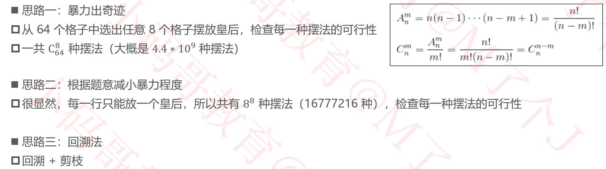
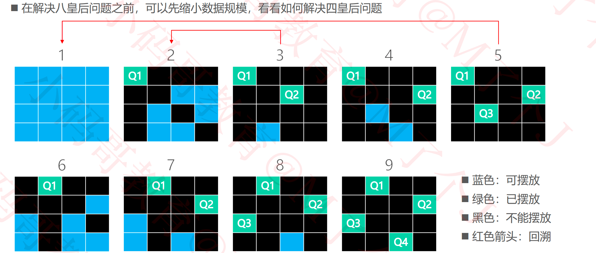

## 回溯（Back Tracking）

### 八皇后问题（Eight Queens）

#### 八皇后问题的解决思路

#### 四皇后

##### 四皇后 – 回溯法

##### 四皇后 – 剪枝（Pruning）

#### 八皇后 – 回溯法

#### 八皇后实现 – 合法性检查

#### 八皇后实现 – 打印

#### 八皇后实现 – 从某一行开始摆放皇后

#### 八皇后实现 – 摆放所有皇后

#### 八皇后优化 – 成员变量

#### 八皇后优化 – 从某一行开始摆放皇后

#### 八皇后优化 – 摆放所有皇后

#### 八皇后优化 – 对角线

#### 八皇后优化 – 位运算

### 作业

- 全排列：https://leetcode-cn.com/problems/permutations/

- 全排列 II：https://leetcode-cn.com/problems/permutations-ii/
- 组合总和：https://leetcode-cn.com/problems/combination-sum/

- 组合总和 II：https://leetcode-cn.com/problems/combination-sum-ii/
- 子集：https://leetcode-cn.com/problems/subsets/
- 子集 II：https://leetcode-cn.com/problems/subsets-ii/

