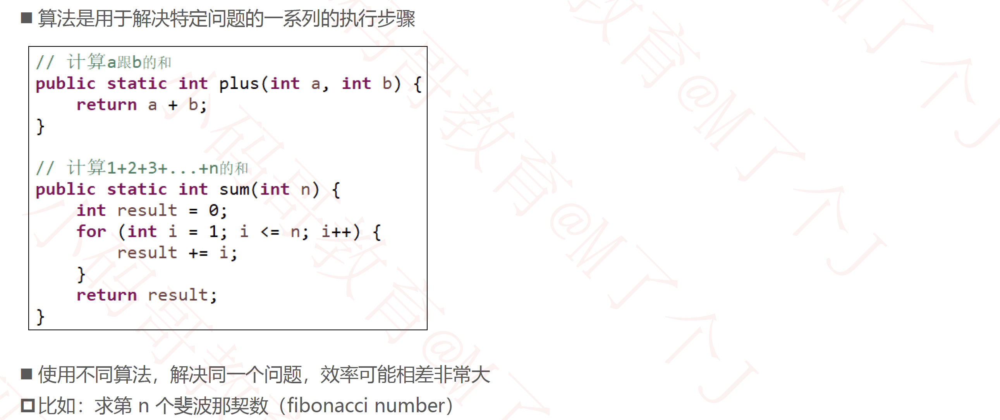
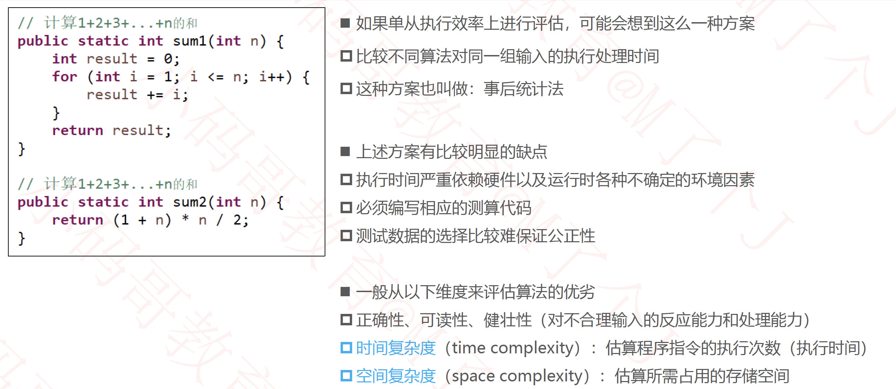
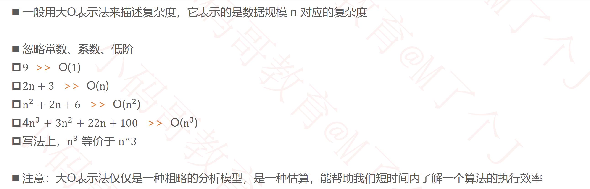
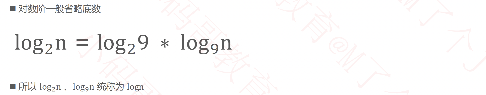
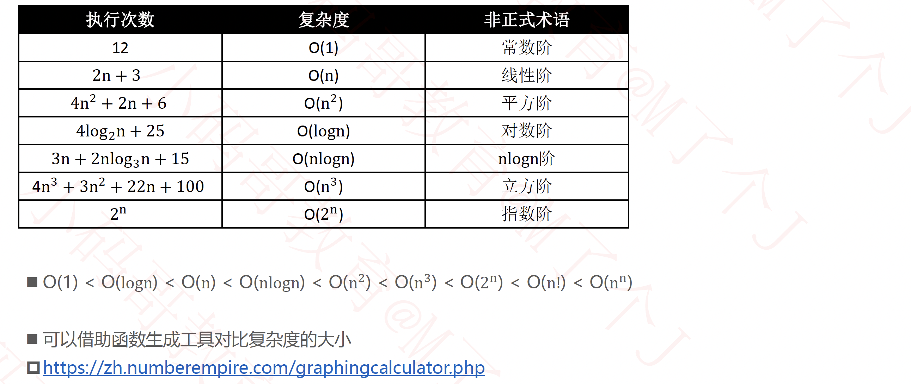
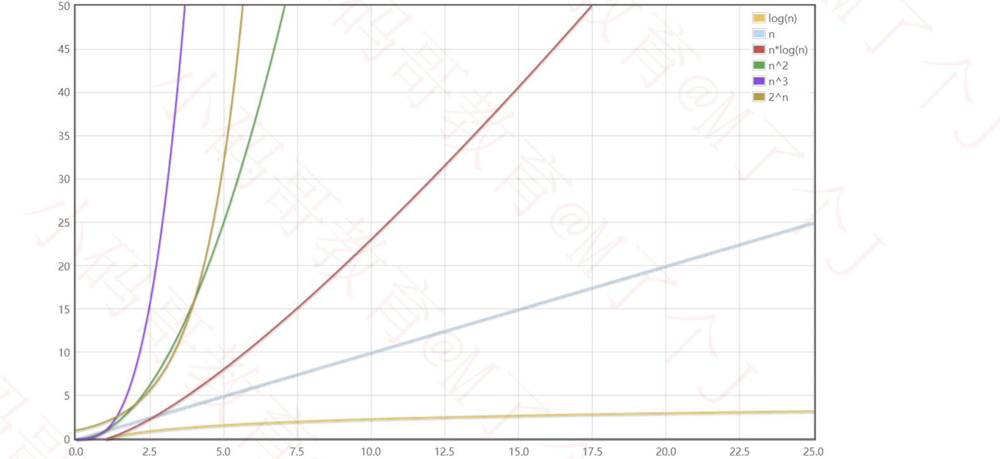
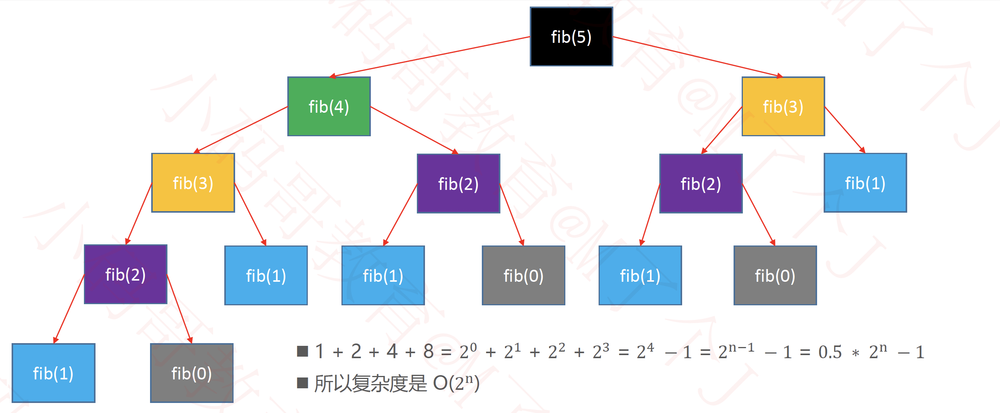
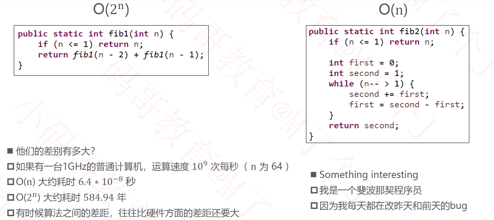
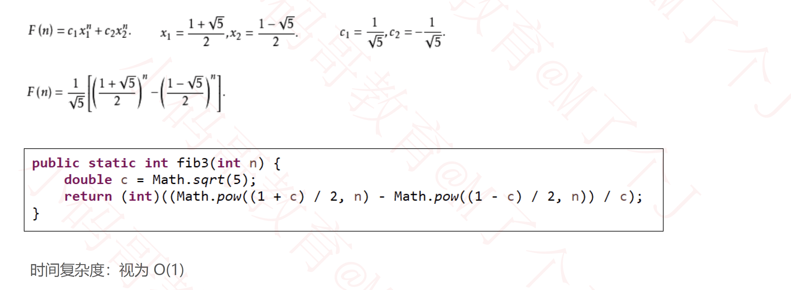
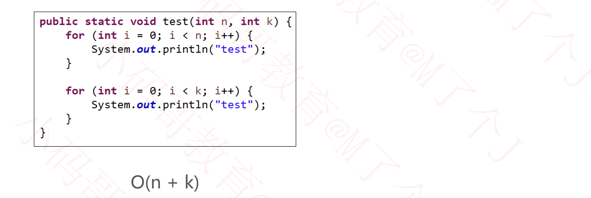

## 复杂度

### 什么是算法

### 如何评判一个算法的好坏？

### 大O表示法（Big O）

### 对数阶段的细节

### 常见的复杂度

- https://zh.numberempire.com/graphingcalculator.php

### fib函数的时间复杂度分析

### 算法的优化方向

### 多个数据规模的情况

### 更多知识

