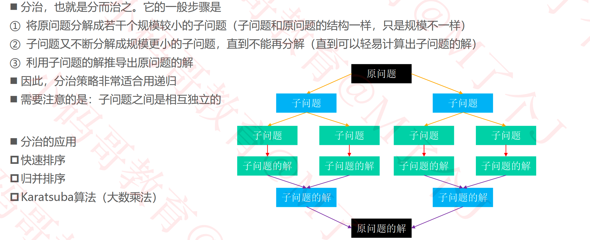
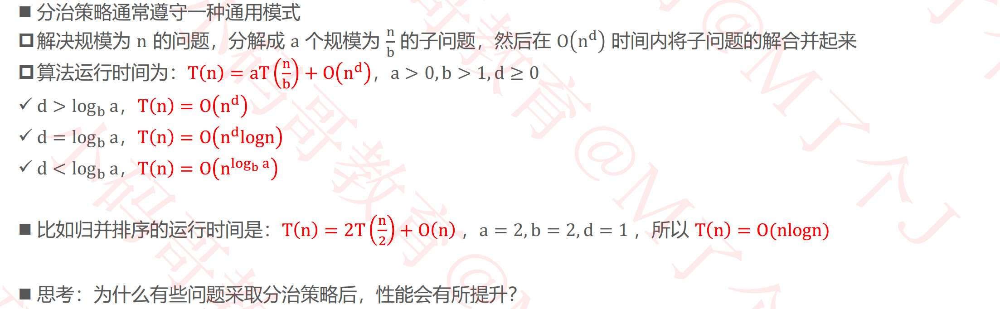
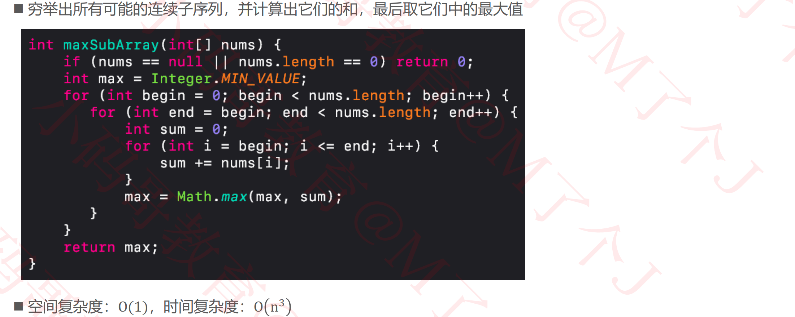
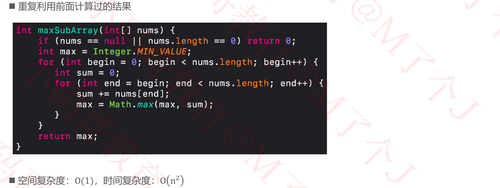
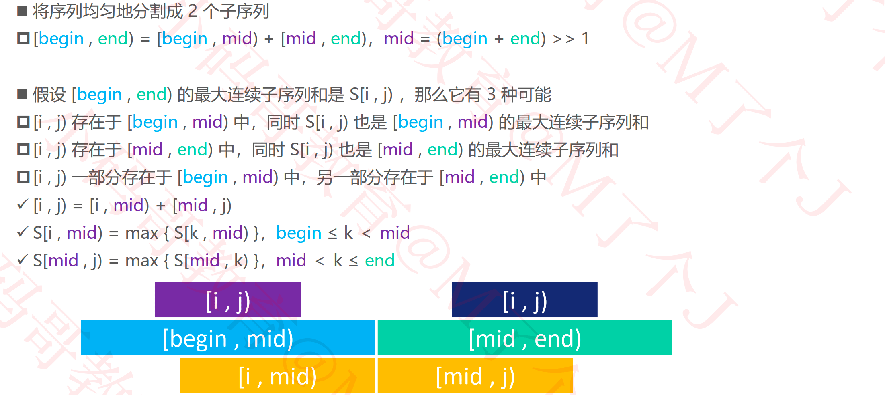
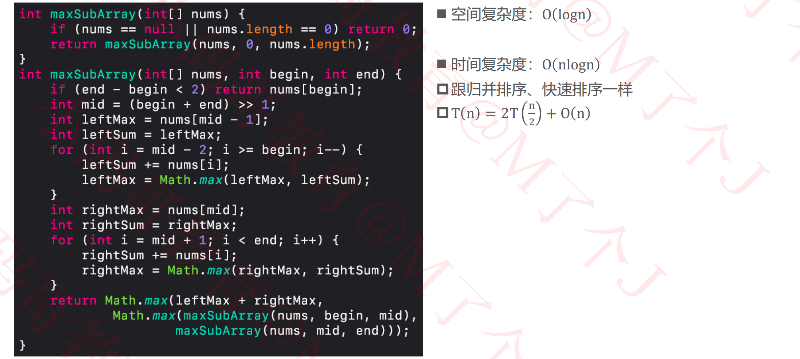
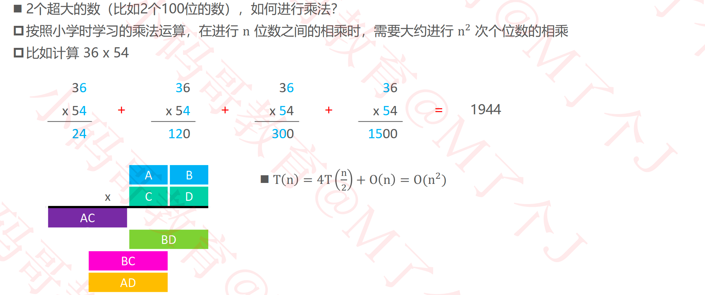
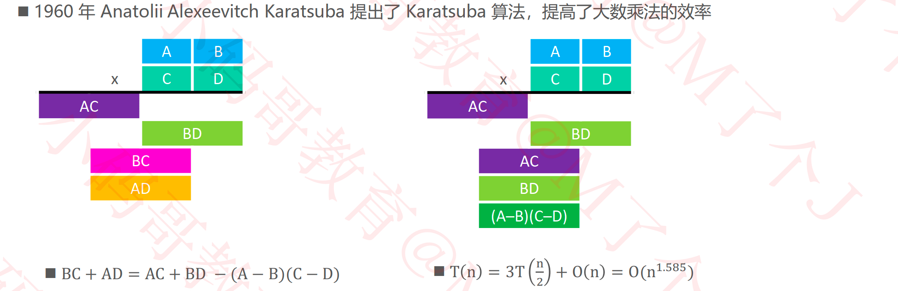

## 分治（Divide And Conquer）

### 主定理（Master Theorem）

### 练习1 – 最大连续子序列和

- 最大子序和：https://leetcode-cn.com/problems/maximum-subarray/

#### 解法1 – 暴力出奇迹

#### 解法1 – 暴力出奇迹 – 优化

#### 解法2 – 分治

### 练习2 – 大数乘法

