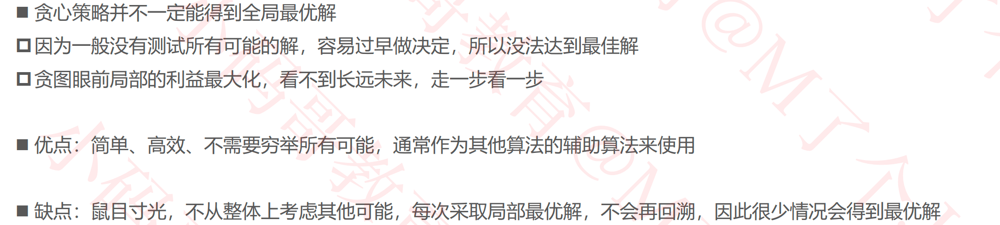

## 贪心（Greedy）

### 练习1 – 最优装载问题（加勒比海盗）

### 练习2 – 零钱兑换

#### 零钱兑换的另一个例子

#### 注意

### 练习3 – 0-1背包

#### 实例

#### 实现

### 作业

- 分发饼干：https://leetcode-cn.com/problems/assign-cookies/
- 用最少数量的箭引爆气球：https://leetcode-cn.com/problems/minimum-number-of-arrows-to-burst-balloons/
- 买卖股票的最佳时机 II：https://leetcode-cn.com/problems/best-time-to-buy-and-sell-stock-ii/
- 种花问题：https://leetcode-cn.com/problems/can-place-flowers/
- 分发糖果：https://leetcode-cn.com/problems/candy/