## 串（Sequence）

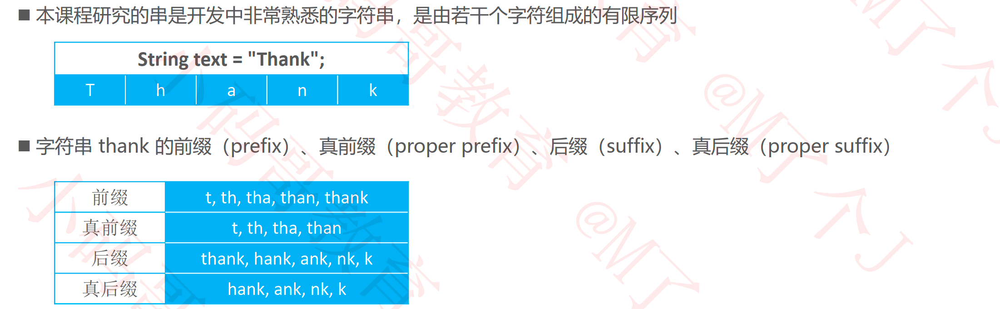

### 串匹配算法

### 蛮力（Brute Force）

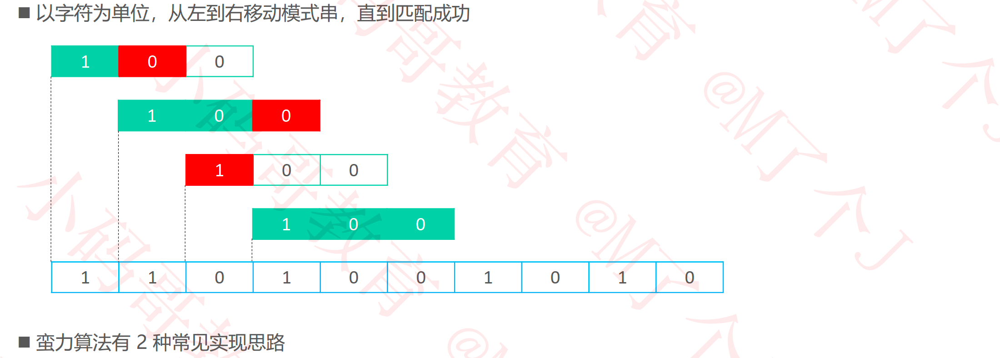

#### 蛮力1 – 执行过程

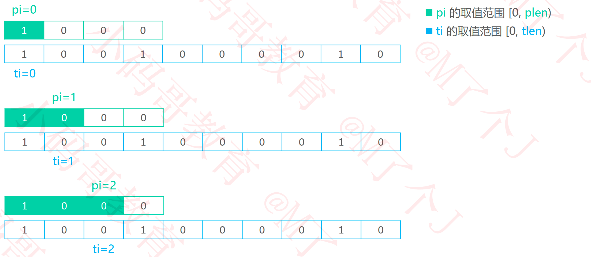

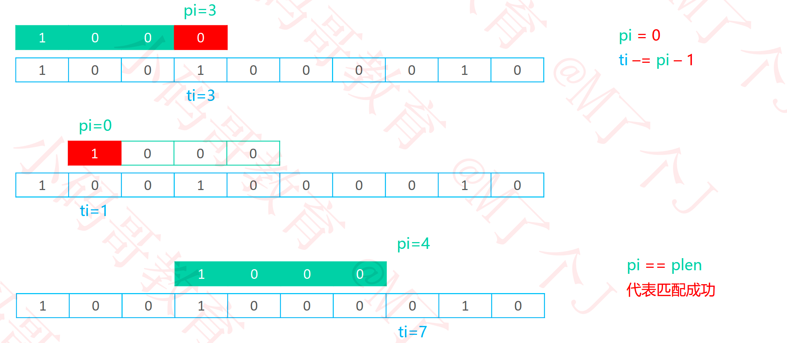

#### 蛮力1 – 实现

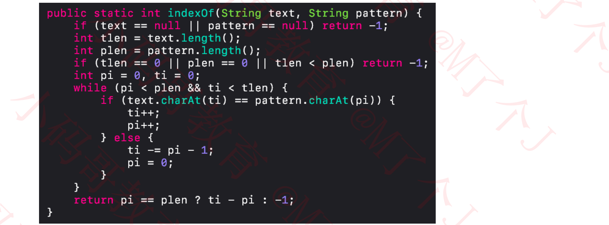

#### 蛮力1 – 优化

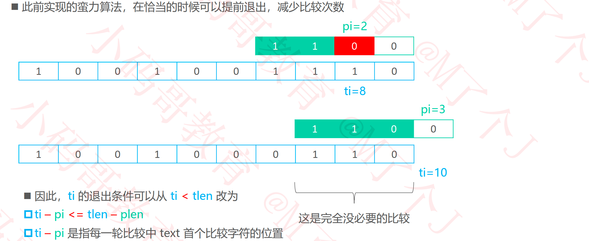

#### 蛮力1 – 优化实现

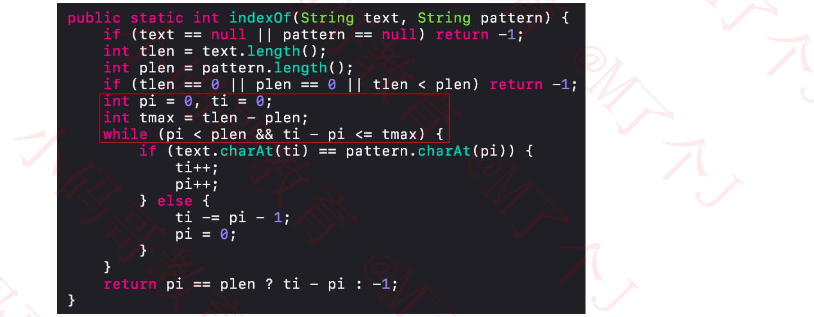

#### 蛮力2 – 执行过程

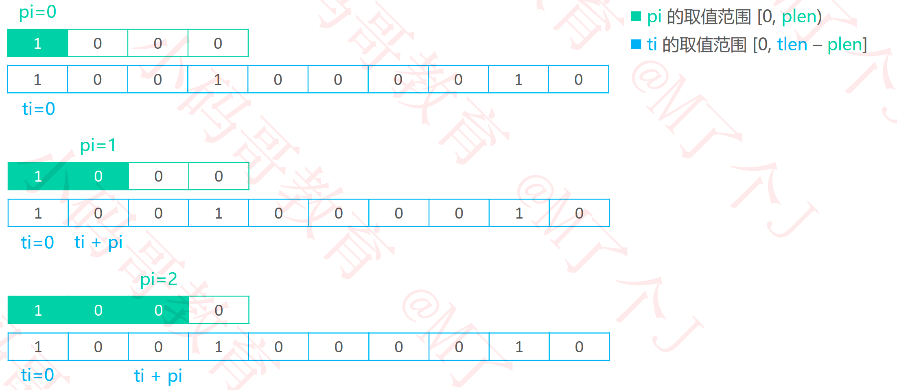

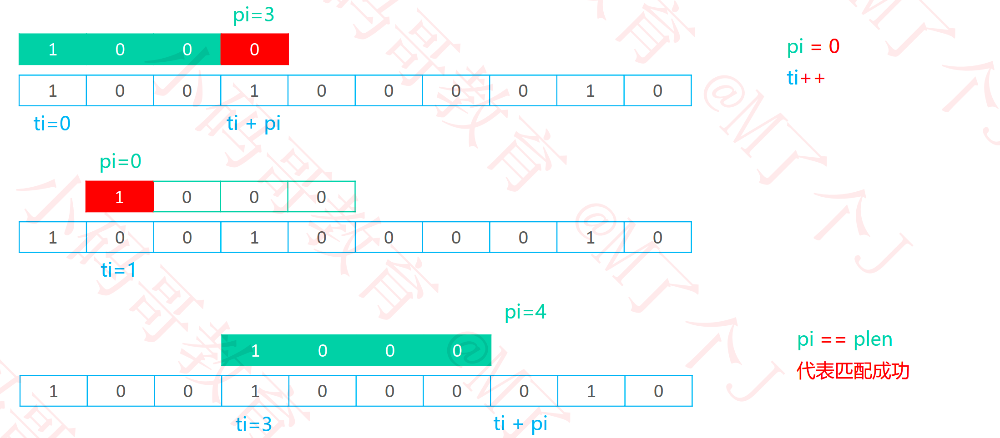

#### 蛮力2 – 实现

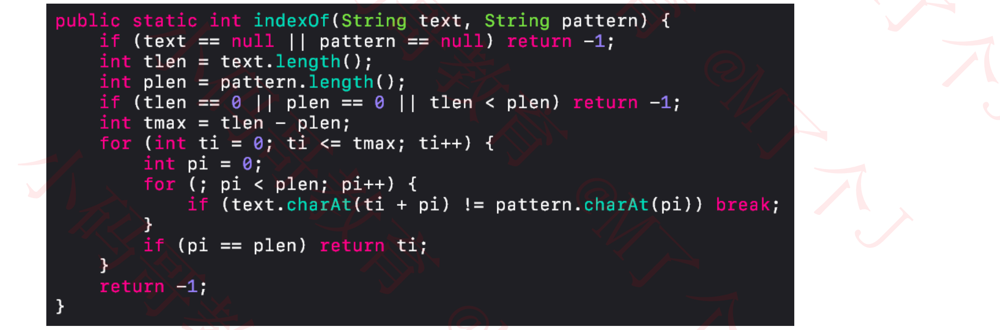

#### 蛮力 – 性能分析

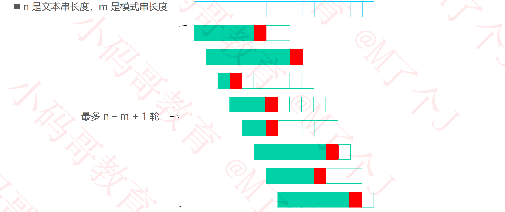

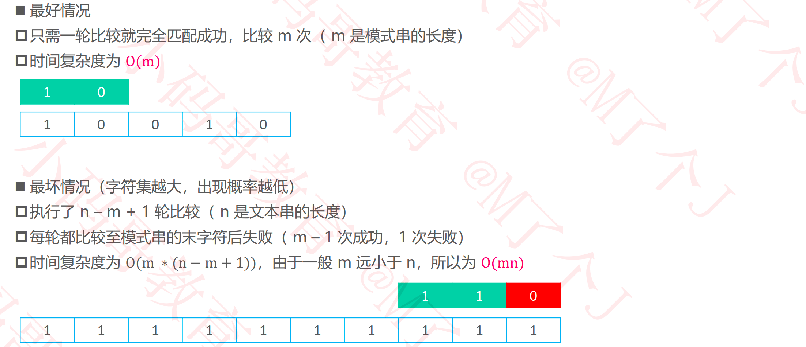

### KMP

#### 蛮力 vs KMP

#### KMP – next表的使用

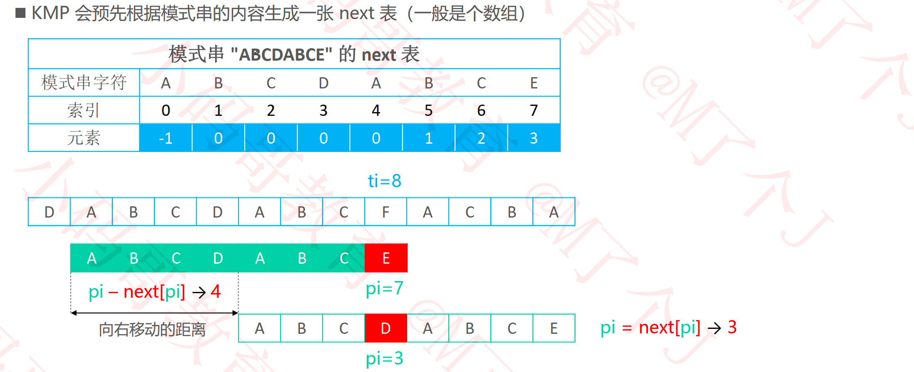

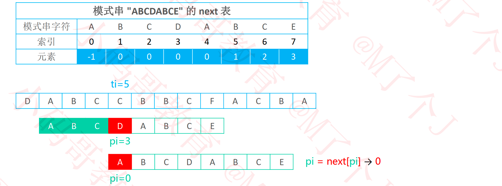

#### KMP – 核心原理

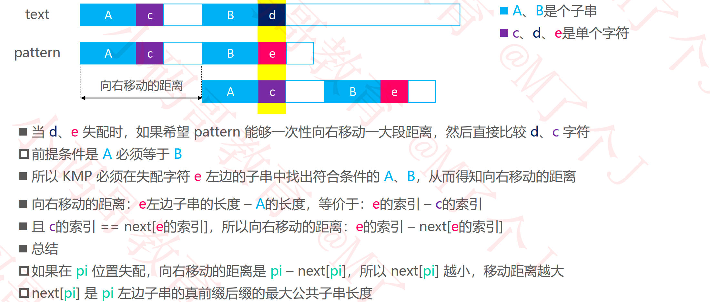

#### KMP – 真前缀后缀的最大公共子串长度

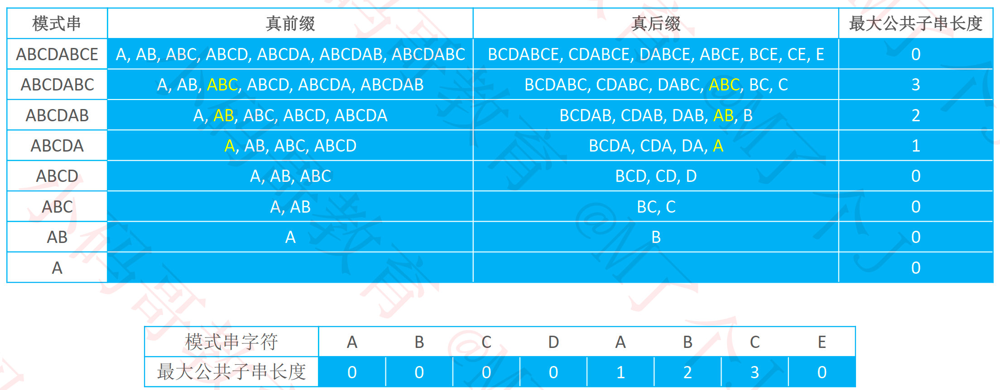

#### KMP – 得到next表

#### KMP – 负1的精妙之处

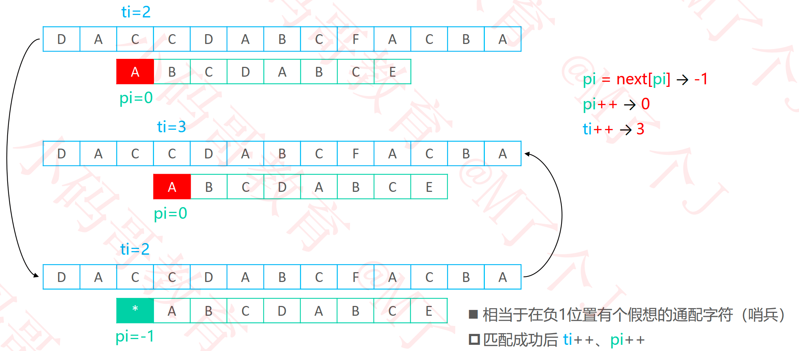

#### KMP – 主算法实现

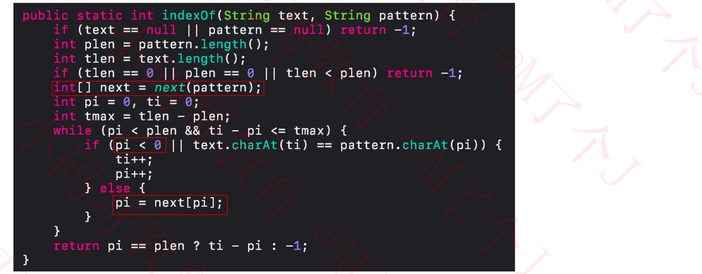

#### KMP – 为什么是“最大“公共子串长度？

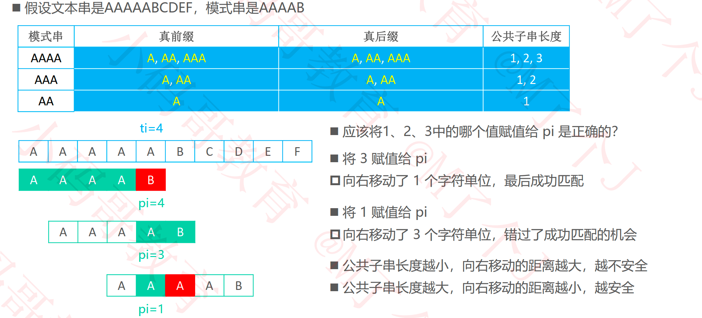

#### KMP – next表的构造思路

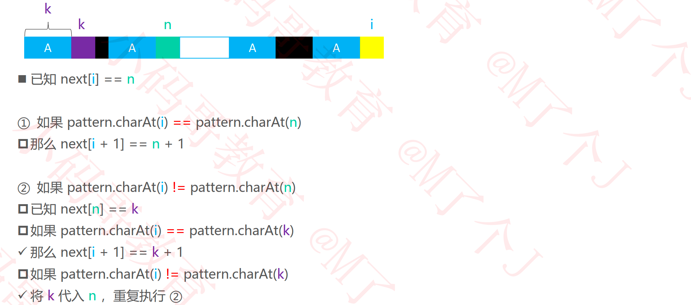

#### KMP – next表的代码实现

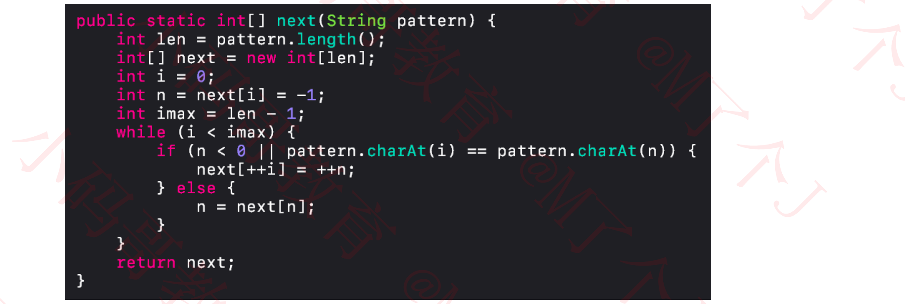

#### KMP – next表的不足之处

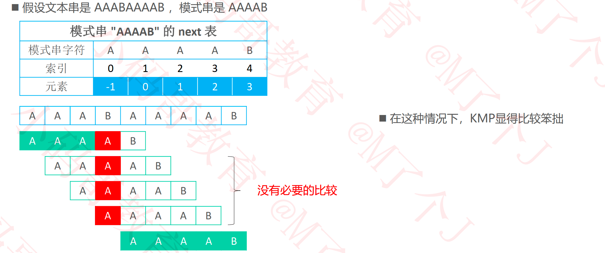

#### KMP – next表的优化思路

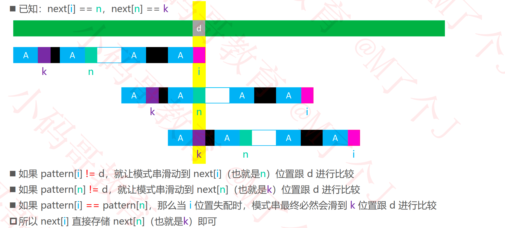

#### KMP – next表的优化实现

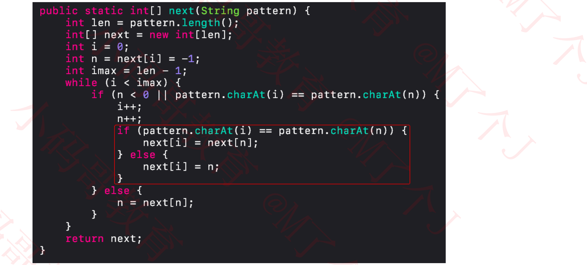

#### KMP – next表的优化效果

#### KMP – 性能分析

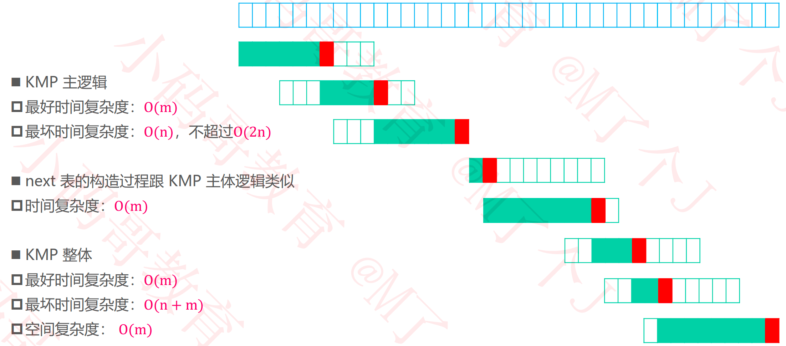

#### 蛮力 vs KMP

