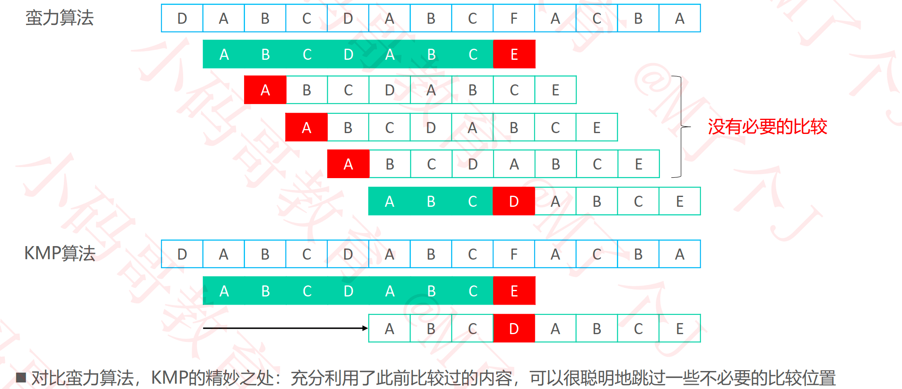

## 串（Sequence）

### 串匹配算法

### 蛮力（Brute Force）

#### 蛮力1 – 执行过程

#### 蛮力1 – 实现

#### 蛮力1 – 优化

#### 蛮力1 – 优化实现

#### 蛮力2 – 执行过程

#### 蛮力2 – 实现

#### 蛮力 – 性能分析

### KMP

#### 蛮力 vs KMP

#### KMP – next表的使用

#### KMP – 核心原理

#### KMP – 真前缀后缀的最大公共子串长度

#### KMP – 得到next表

#### KMP – 负1的精妙之处

#### KMP – 主算法实现

#### KMP – 为什么是“最大“公共子串长度？

#### KMP – next表的构造思路

#### KMP – next表的代码实现

#### KMP – next表的不足之处

#### KMP – next表的优化思路

#### KMP – next表的优化实现

#### KMP – next表的优化效果

#### KMP – 性能分析

#### 蛮力 vs KMP

