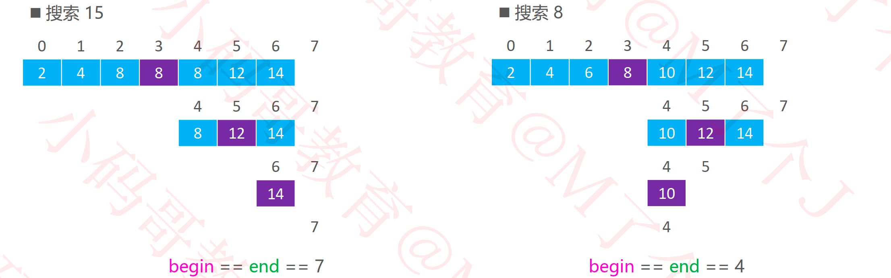
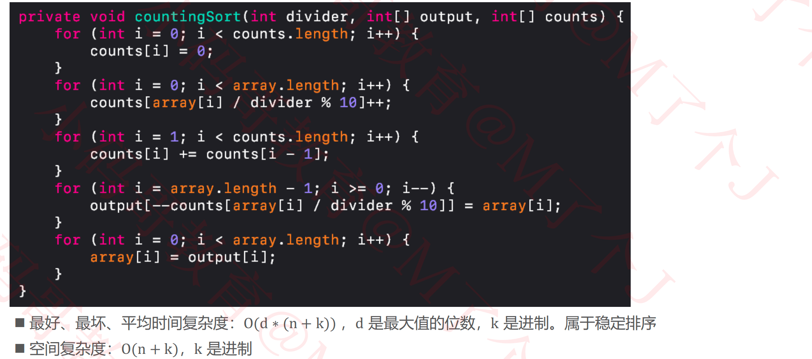

## 排序（Sorting）

### 10大排序算法

#### 排序算法的稳定性（Stability）

#### 原地算法（In-place Algorithm）

### 冒泡排序（Bubble Sort）

#### 优化①

#### 优化②

### 选择排序（Selection Sort）

### 堆排序（Heap Sort）

#### 实现

### 插入排序（Insertion Sort）

#### 逆序对（Inversion）

#### 优化

#### 二分搜索（Binary Search）

#### 二分搜索优化

##### 实例

##### 实现

### 归并排序（Merge Sort）

#### divide

#### merge

##### 细节

##### 左边先结束

##### 右边先结束

##### 实现

#### 复杂度分析

#### 常见的递推式与复杂度

#### 作业

- 合并两个有序数组
  - https://leetcode-cn.com/problems/merge-sorted-array/

- 合并两个有序链表
  - https://leetcode-cn.com/problems/merge-two-sorted-lists/comments/

- 合并K个有序链表
  - https://leetcode-cn.com/problems/merge-k-sorted-lists/

### 快速排序（Quick Sort）

#### 执行流程

#### 轴点构造

#### 时间复杂度

#### 实现

#### 与轴点相等的元素

### 希尔排序（Shell Sort）

#### 实例

#### 实现

#### 步长序列

### 计数排序（Counting Sort）

#### 最简单的实现

#### 改进思路

> **注意：**
>
> 1. 次数每次都会减一（注意黄色格子数字变化）
> 2. 数组倒着遍历是为了稳定性（原数组在后面的7，排序后还在后面）

#### 改进实现

#### 对自定义对象进行排序

### 基数排序（Radix Sort）

> 不能先从高位，位数不够，高位都是0

#### 实现

#### 另一种思路

### 桶排序（Bucket Sort）

实现

### 史上“最强”排序 – 休眠排序

