## 动态数组

### 什么是数据结构？

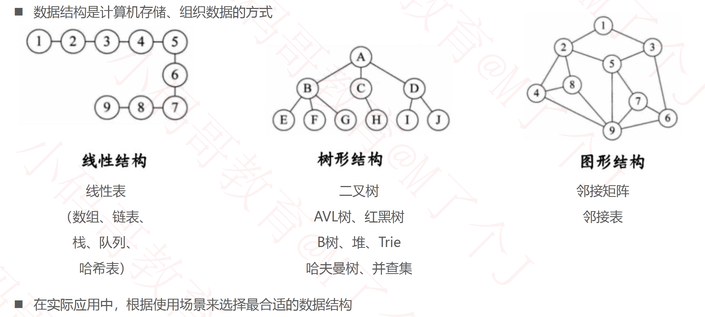

### 线性表

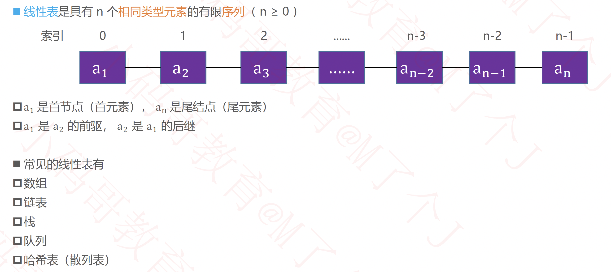

### 动态数组（Dynamic Array）

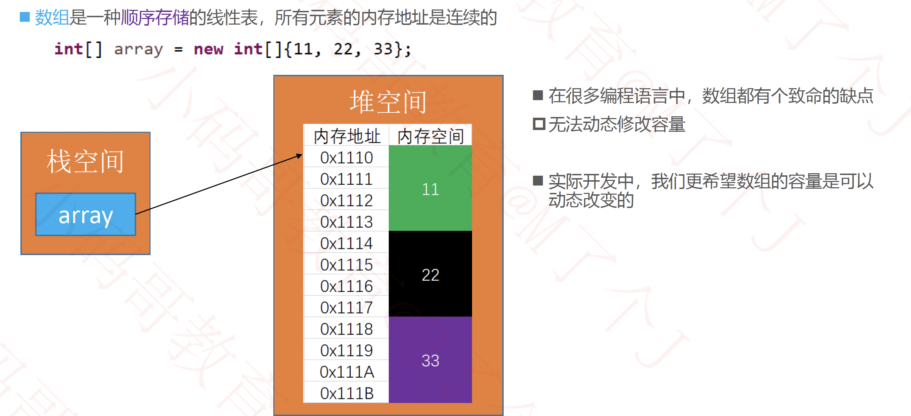

#### 接口设计

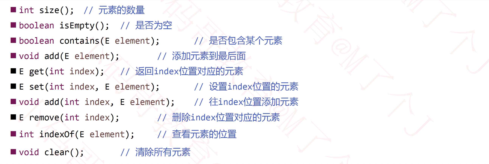

#### 动态数组设计

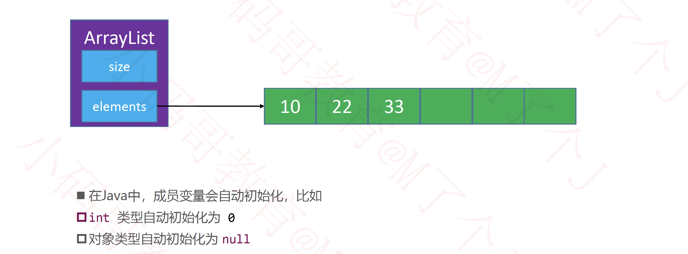

#### 添加元素 - add(E Element)

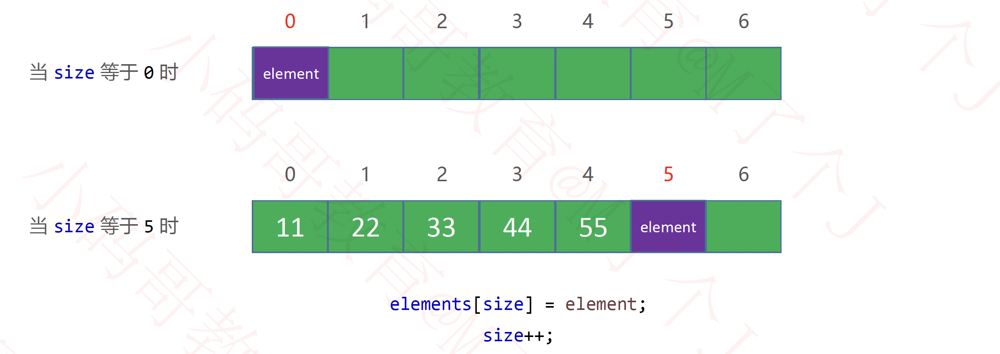

#### 添加元素- add(int index, E element)

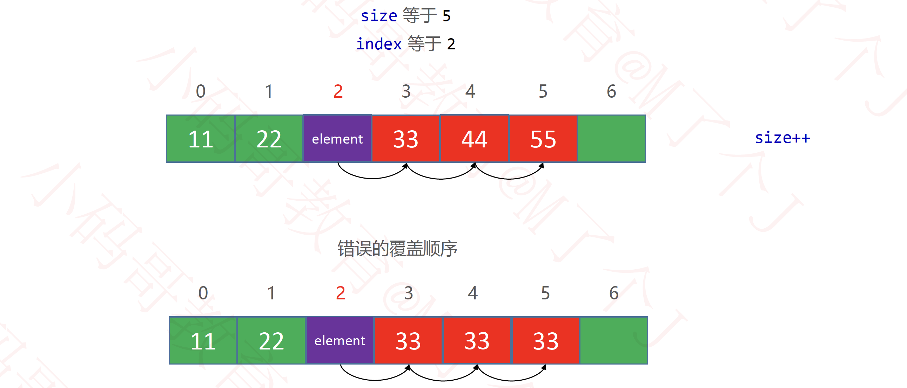

#### 打印数组

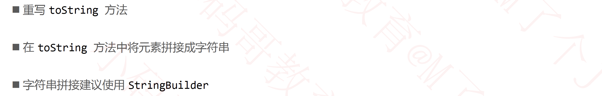

#### 删除元素 - remove(int index)

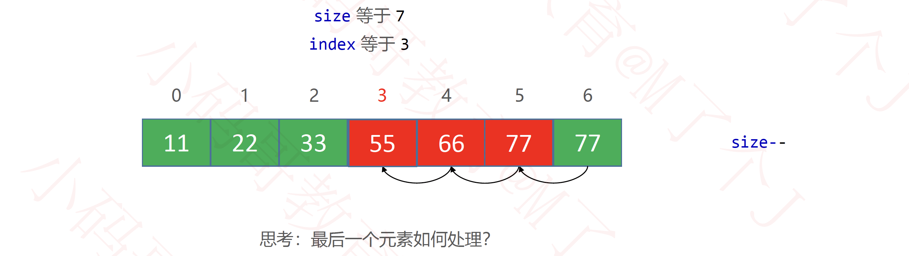

#### 扩容

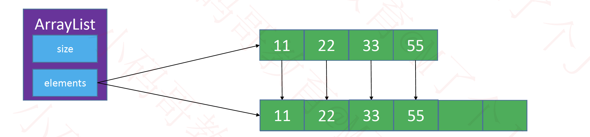

#### 泛型

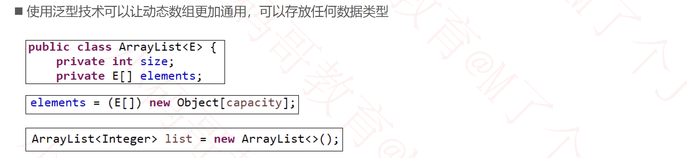

#### 对象数组

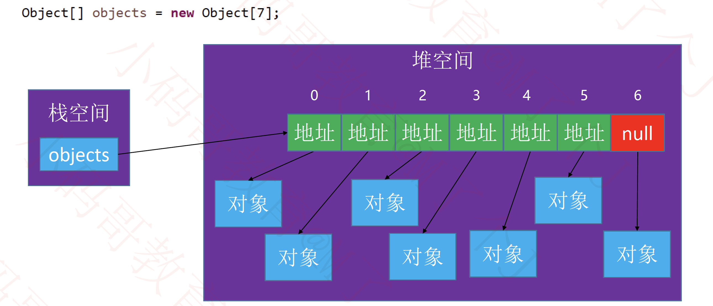

#### 内存管理细节

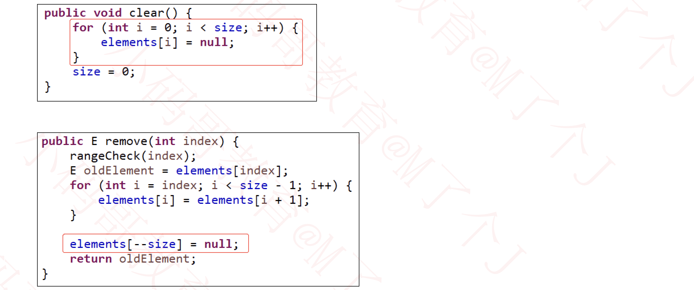

#### null的处理

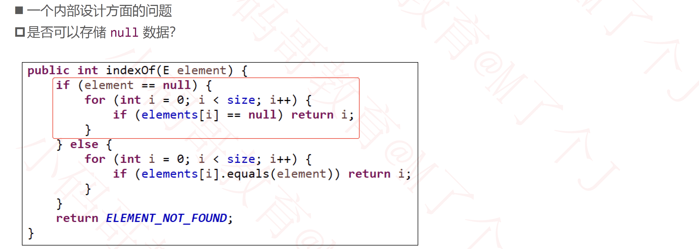

#### java.util.ArrayList

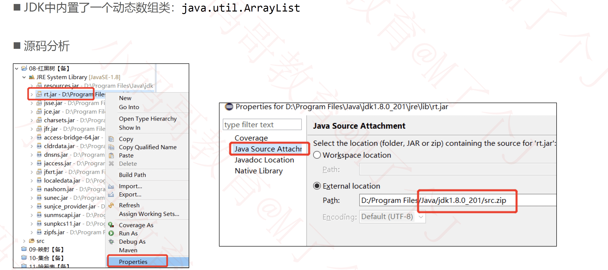