## 思考

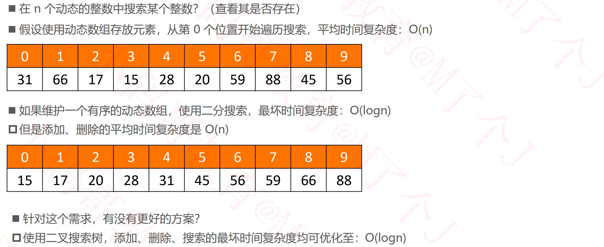

## 推荐一些神奇的网站

- http://520it.com/binarytrees/
- http://btv.melezinek.cz/binary-search-tree.html
- https://www.cs.usfca.edu/~galles/visualization/Algorithms.html
- https://yangez.github.io/btree-js/
- https://www.codelike.in

## 二叉搜索树（Binary Search Tree）

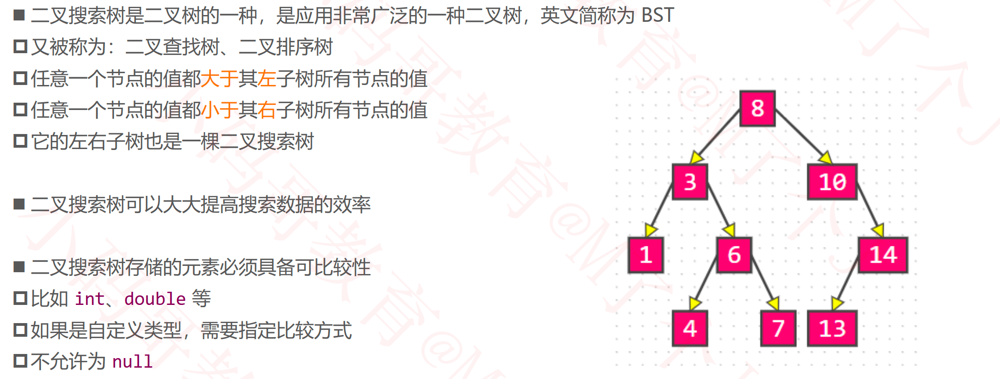

### 接口设计

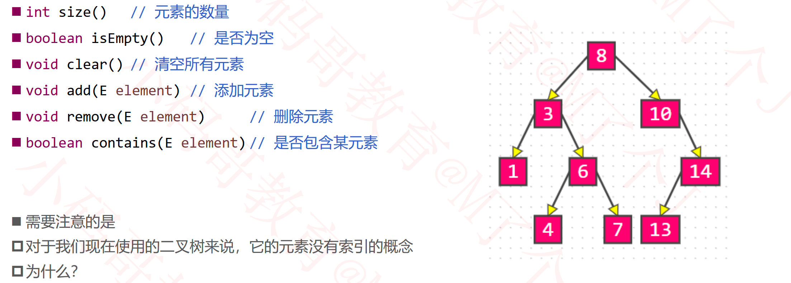

### 添加节点

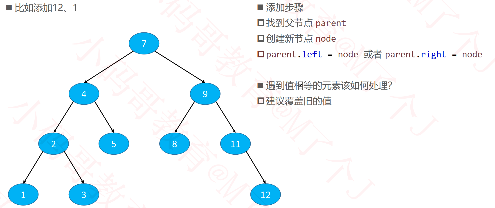

#### 元素的比较方案设计

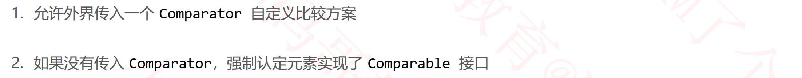

#### 打印二叉树

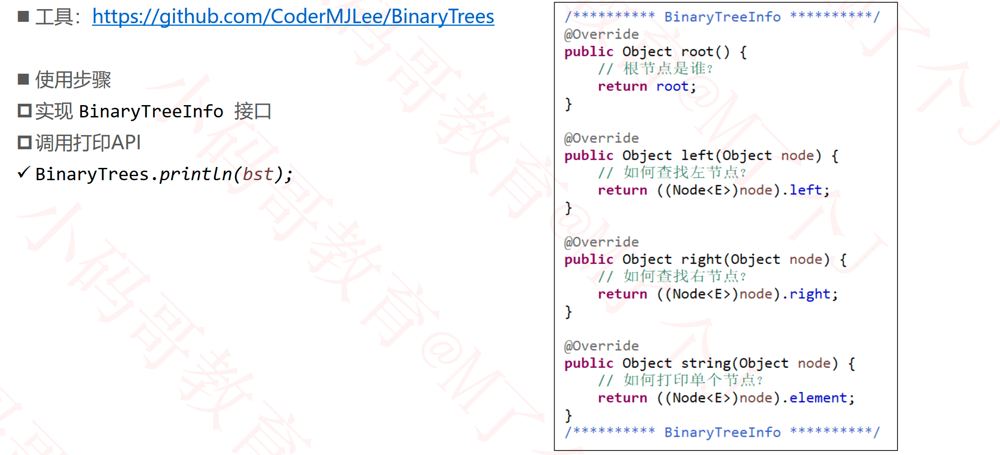

#### 根据元素内容获取节点

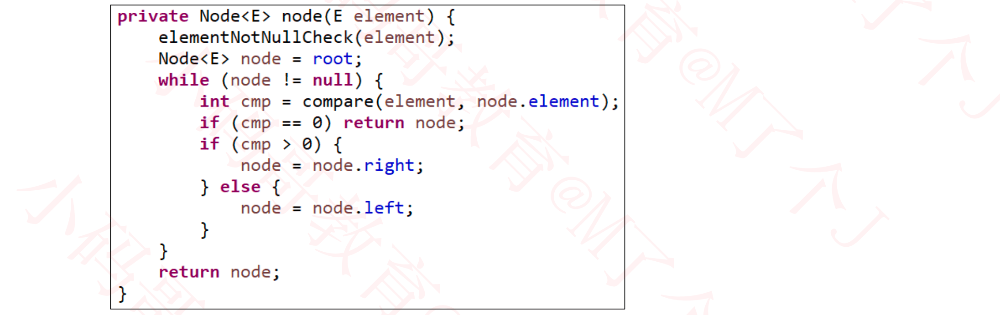

### 删除节点

#### 删除叶子节点

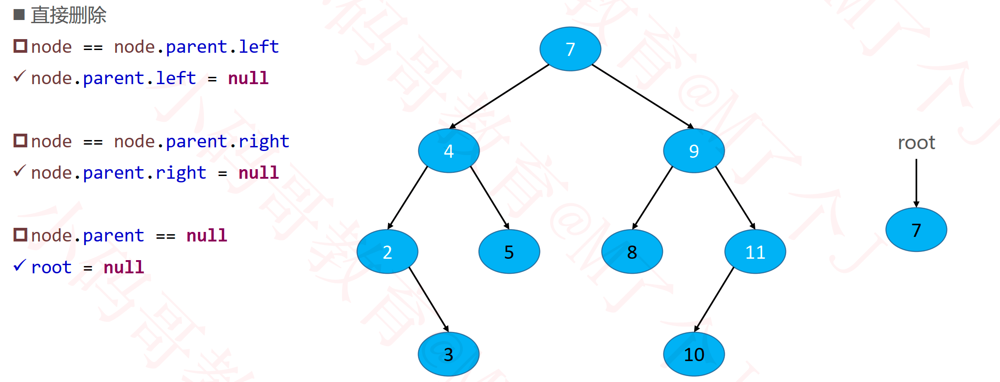

#### 删除度为1的节点

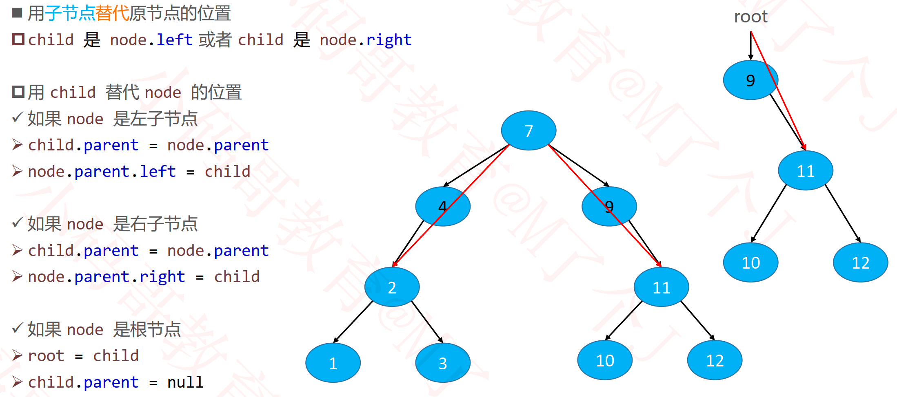

#### 删除度为2的节点

### 简单的继承结构

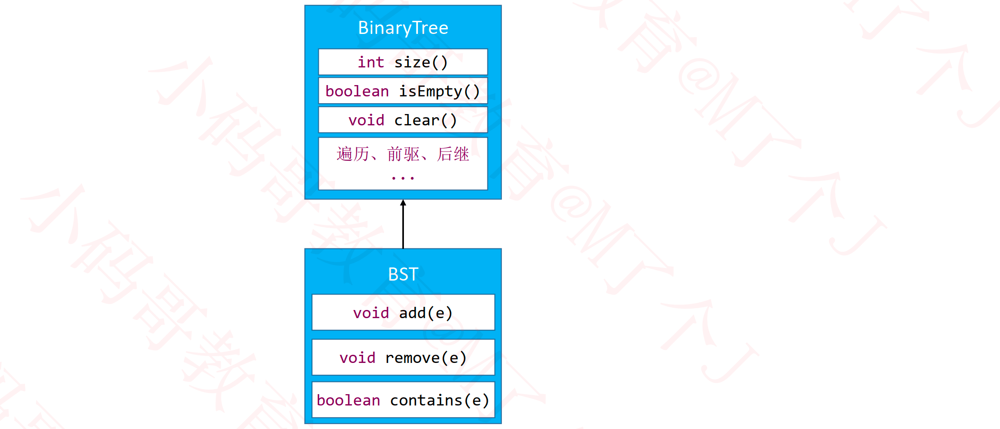

### 作业

#### 删除二叉搜索树中的节点

- https://leetcode-cn.com/problems/delete-node-in-a-bst/

#### 二叉搜索树中的搜索 

- https://leetcode-cn.com/problems/search-in-a-binary-search-tree/

#### 二叉搜索树中的插入操作

- https://leetcode-cn.com/problems/insert-into-a-binary-search-tree/

#### 验证二叉搜索树

- https://leetcode-cn.com/problems/validate-binary-search-tree/comments/

#### 二叉搜索树的最小绝对差

-  https://leetcode-cn.com/problems/minimum-absolute-difference-inbst/comments/ 

#### 二叉搜索树结点最小距离 

- https://leetcode-cn.com/problems/minimum-distance-between-bstnodes/comments/

#### 将有序数组转换为二叉搜索树

- https://leetcode-cn.com/problems/convert-sorted-array-to-binary-searchtree/

#### 二叉搜索树的范围和

- https://leetcode-cn.com/problems/range-sum-of-bst/

#### 二叉搜索树的最近公共祖先

- https://leetcode-cn.com/problems/lowest-common-ancestor-of-a-binarysearch-tree/

#### 二叉搜索树中第K小的元素

- https://leetcode-cn.com/problems/kth-smallest-element-in-a-bst/

#### 二叉搜索树迭代器

- https://leetcode-cn.com/problems/binary-search-tree-iterator/

#### 恢复二叉搜索树

- https://leetcode-cn.com/problems/recover-binary-search-tree/

## 平衡二叉搜索树

### 二叉搜索树的复杂度分析

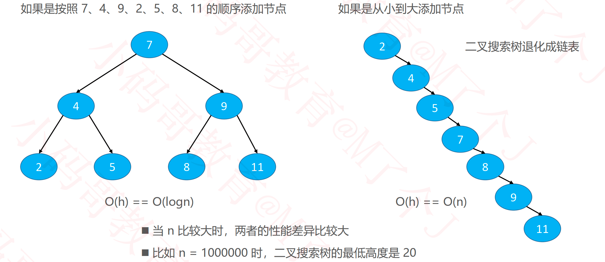

### 退化成链表的另一种情况

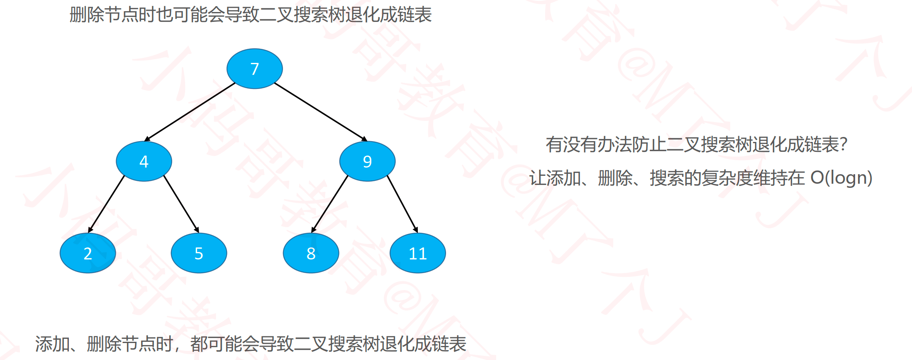

### 平衡（Balance）

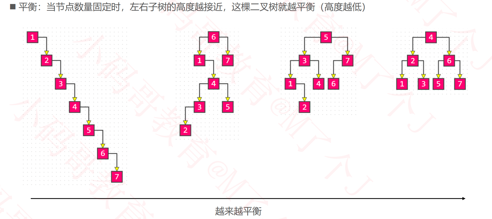

### 理想平衡

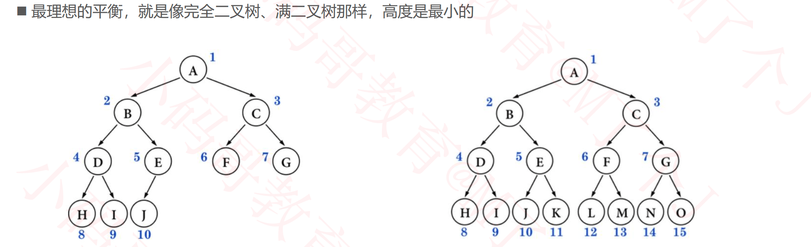

### 如何改进二叉搜索树？

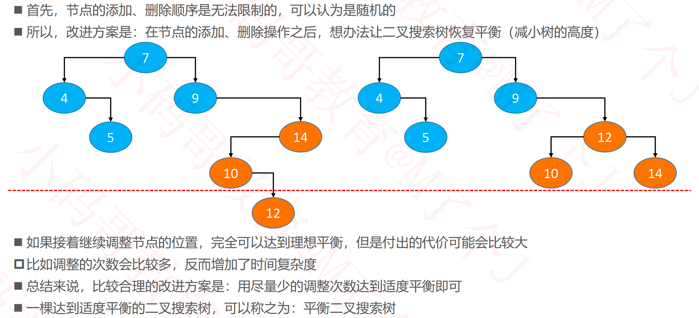

### 平衡二叉搜索树（Balanced Binary Search Tree）

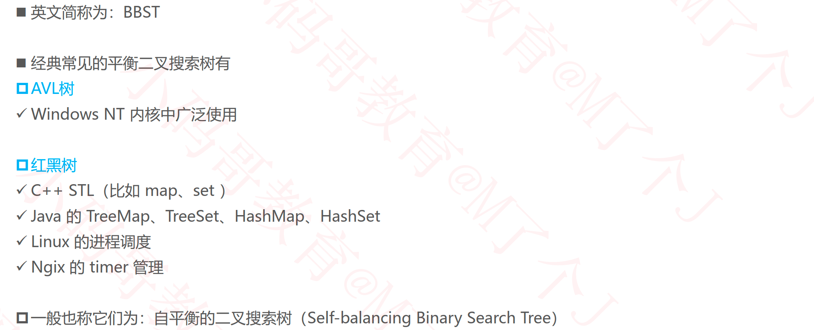