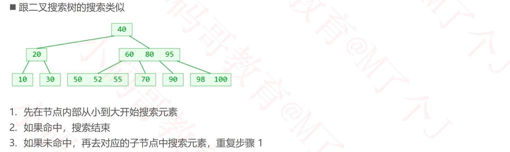
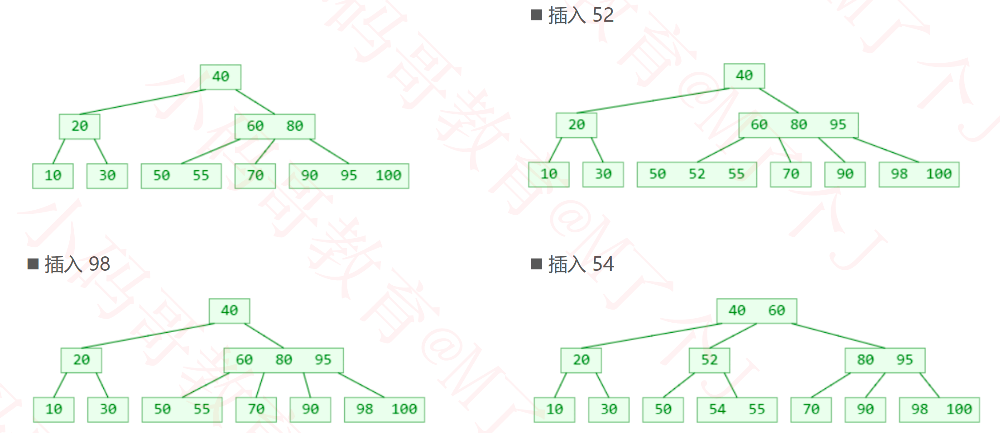
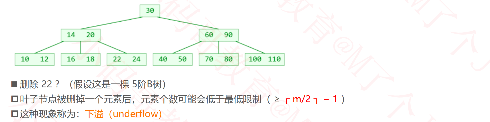
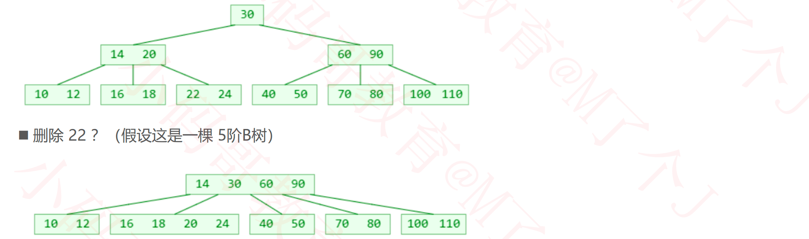
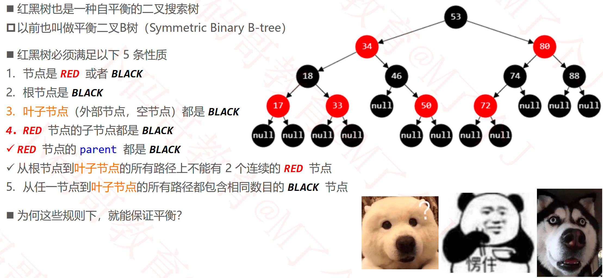
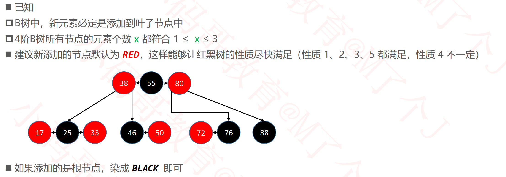
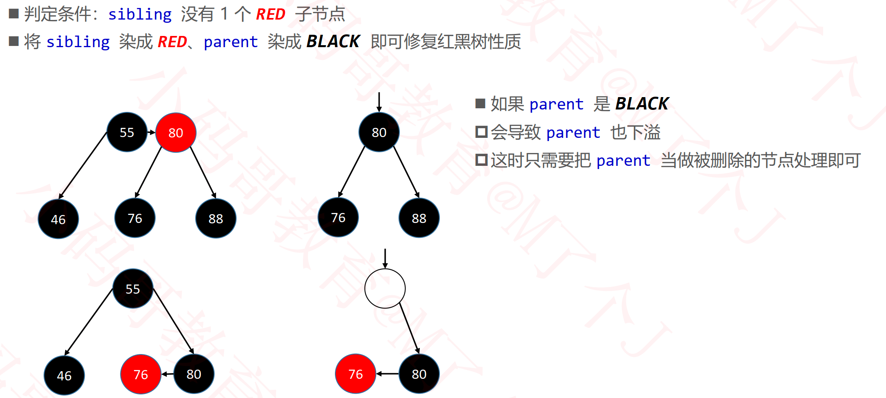
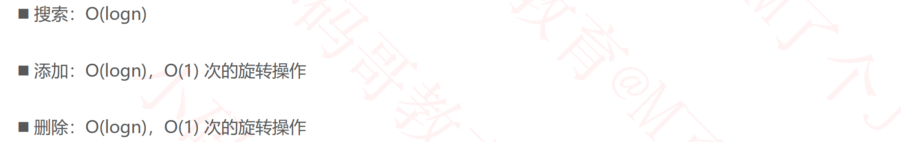

## B树（B-tree、 B-树）

### m阶B树的性质（m≥2）

### B树 VS 二叉搜索树

### 搜索

### 添加

#### 上溢的解决(假设5阶)

### 删除

#### 删除叶子节点

#### 删除非叶子节点

#### 下溢

#### 下溢的解决

#### 删除

### 4阶B树

## 红黑树（Red Black Tree）

### 请问下面这棵是红黑树么？

### 红黑树的等价变换

### 红黑树 vs 2-3-4树

### 几个英文单词

### 一些辅助函数

### 添加

#### 添加的所有情况

- 前4种上溢的情况只需将grand当做新添加的node处理，后4种进行旋转，如下。

#### 修复性质4 – 上溢 – LL

#### 修复性质4 – 上溢 – RR

#### 修复性质4 – 上溢 – LR

#### 修复性质4 – 上溢 – RL

- 上溢的四种情况，处理方式相同

#### 修复性质4 – LL\RR

#### 修复性质4 – LR\RL

### 删除

#### 删除RED节点

#### 删除BLACK节点

##### 删除拥有1个RED子节点的BLACK节点

##### 删除BLACK叶子节点

###### sibling为RED

- 从左往右执行

###### sibling为BLACK

- 红黑树从上面的图形旋转删除后成为下面的图形

### 红黑树的平衡

### 平均时间复杂度

### AVL树 vs 红黑树

### BST vs AVL Tree vs Red Black Tree

