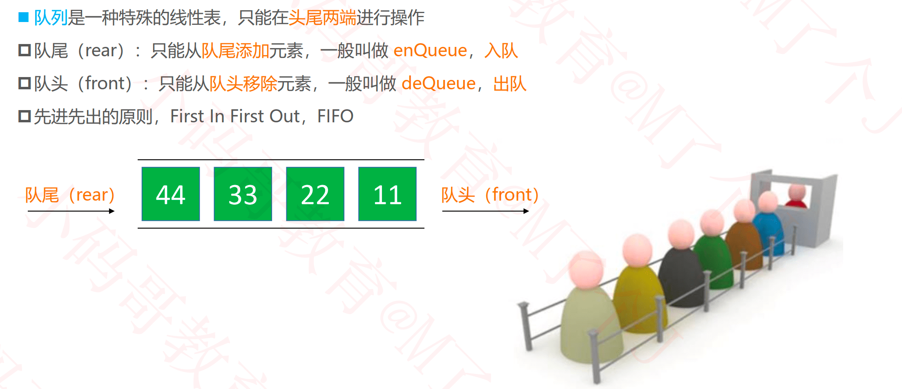
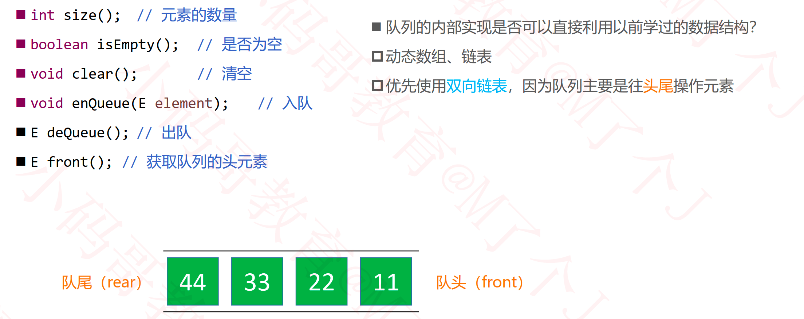
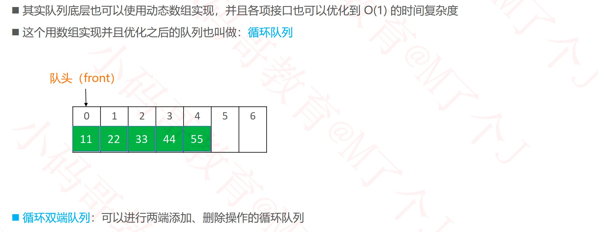
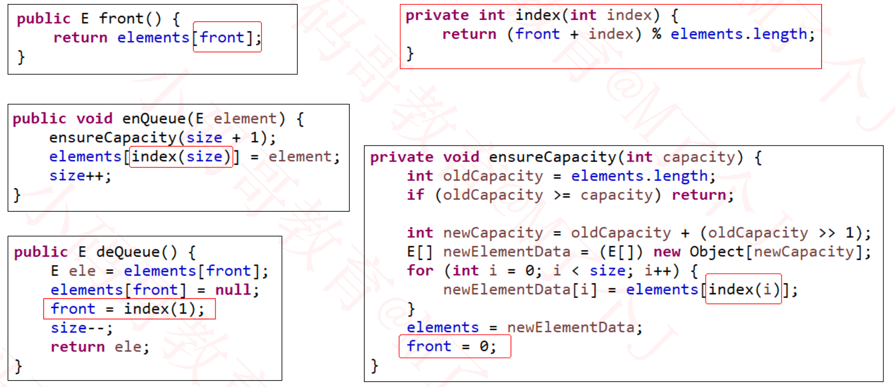
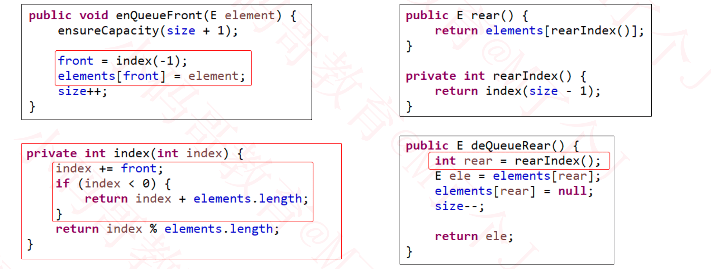
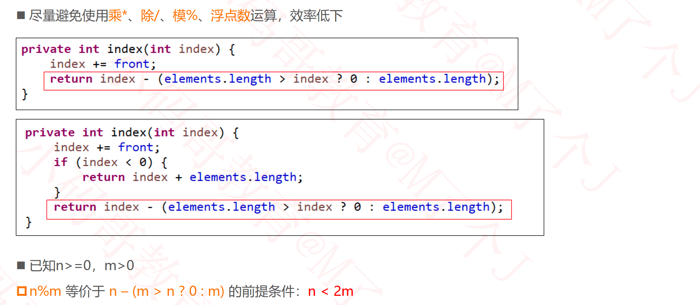

## 队列

### 队列的接口设计

## 双端队列（Deque）

## 循环队列（Circle Queue）

## 循环双端队列

### %运算符优化

## 练习

### 用栈实现队列

- https://leetcode-cn.com/problems/implement-queue-using-stacks/

### 用队列实现栈

- https://leetcode-cn.com/problems/implement-stack-using-queues/