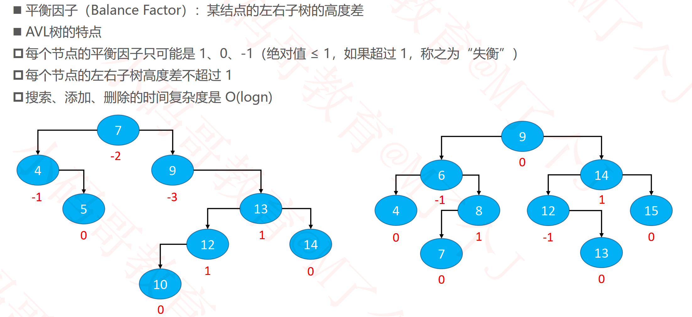

## AVL树

### 平衡对比

### 简单的继承结构

### 添加导致的失衡

#### LL – 右旋转（单旋）

#### RR – 左旋转（单旋）

#### LR – RR左旋转， LL右旋转（双旋）

#### RL – LL右旋转， RR左旋转（双旋）

#### zig、 zag

#### 添加之后的修复

#### 旋转

#### 示例

#### 统一所有旋转操作

#### 独立出AVLNode

### 删除导致的失衡

#### LL – 右旋转（单旋）

#### RR – 左旋转（单旋）

#### LR – RR左旋转， LL右旋转（双旋）

#### RL – LL右旋转， RR左旋转（双旋）

#### 删除之后的修复

### 总结

### 作业

####  平衡二叉树

- https://leetcode-cn.com/problems/balanced-binary-tree/