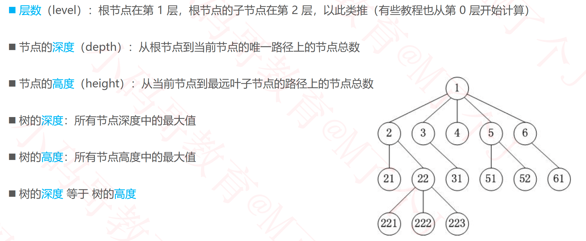
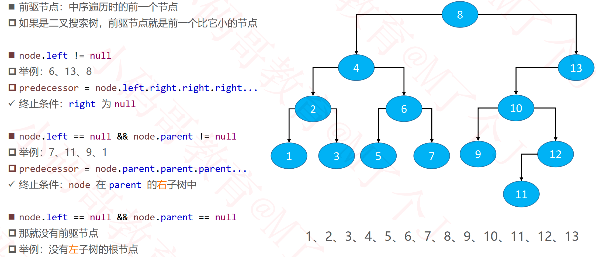

## 树（Tree）

### 基本概念

### 有序树、无序树、森林

## 二叉树（Binary Tree）

### 二叉树的性质

### 真二叉树（Proper Binary Tree）

### 满二叉树（Full Binary Tree）

### 完全二叉树（Complete Binary Tree）

#### 完全二叉树的性质

### 面试题

### 国外教材的说法

### 二叉树的遍历

#### 前序遍历（Preorder Traversal）

#### 前序遍历 – 非递归

#### 中序遍历（Inorder Traversal）

#### 中序遍历 – 非递归

#### 后序遍历（Postorder Traversal）

#### 后序遍历 – 非递归

#### 层序遍历（Level Order Traversal）

#### 四则运算

#### 表达式树

#### 思考

#### 增强遍历接口

#### 遍历的应用

#### 根据遍历结果重构二叉树

#### 前序遍历+中序遍历重构二叉树

#### 练习

##### 利用前序遍历树状打印二叉树

##### 翻转二叉树

- https://leetcode-cn.com/problems/invert-binary-tree/

##### 计算二叉树的高度

##### 判断一棵树是否为完全二叉树

### 前驱节点（predecessor）

### 后继节点（successor）

### 作业

#### 二叉树的前序遍历

- https://leetcode-cn.com/problems/binary-tree-preorder-traversal/

####  二叉树的中序遍历

- https://leetcode-cn.com/problems/binary-tree-inorder-traversal/

#### 二叉树的后序遍历

- https://leetcode-cn.com/problems/binary-tree-postorder-traversal/ 

#### 二叉树的层次遍历

- https://leetcode-cn.com/problems/binary-tree-level-order-traversal/

#### 二叉树的最大深度

- https://leetcode-cn.com/problems/maximum-depth-of-binary-tree/ 

#### 二叉树的层次遍历II

- https://leetcode-cn.com/problems/binary-tree-level-order-traversal-ii/

#### 二叉树最大宽度

- https://leetcode-cn.com/problems/maximum-width-of-binary-tree/

#### N叉树的前序遍历

- https://leetcode-cn.com/problems/n-ary-tree-preorder-traversal/

#### N叉树的后序遍历

- https://leetcode-cn.com/problems/n-ary-tree-postorder-traversal/

#### N叉树的最大深度

- https://leetcode-cn.com/problems/maximum-depth-of-n-ary-tree/

#### 二叉树展开为链表

- https://leetcode-cn.com/problems/flatten-binary-tree-to-linked-list/

#### 从中序与后序遍历序列构造二叉树

- https://leetcode-cn.com/problems/construct-binary-tree-from-inorder-and-postorder-traversal/

#### 从前序与中序遍历序列构造二叉树

- https://leetcode-cn.com/problems/construct-binary-tree-from-preorder-and-inorder-traversal/

#### 根据前序和后序遍历构造二叉树

- https://leetcode-cn.com/problems/construct-binary-tree-from-preorder-and-postorder-traversal/

#### 对称二叉树

- https://leetcode-cn.com/problems/symmetric-tree/

#### 树状形式打印二叉树

开源项目： https://github.com/CoderMJLee/BinaryTrees

#### 已知前序、中序遍历结果，求出后序遍历结果

#### 已经中序、后序遍历结果，求出前序遍历结果