## 思考

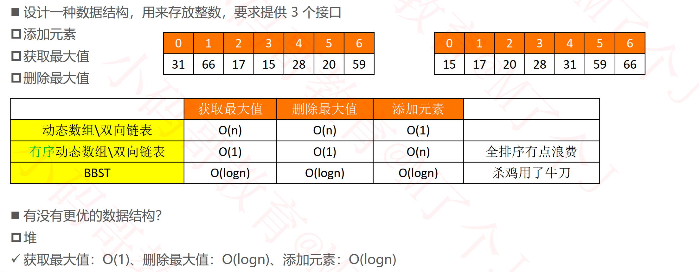

## Top K问题

## 堆（Heap）

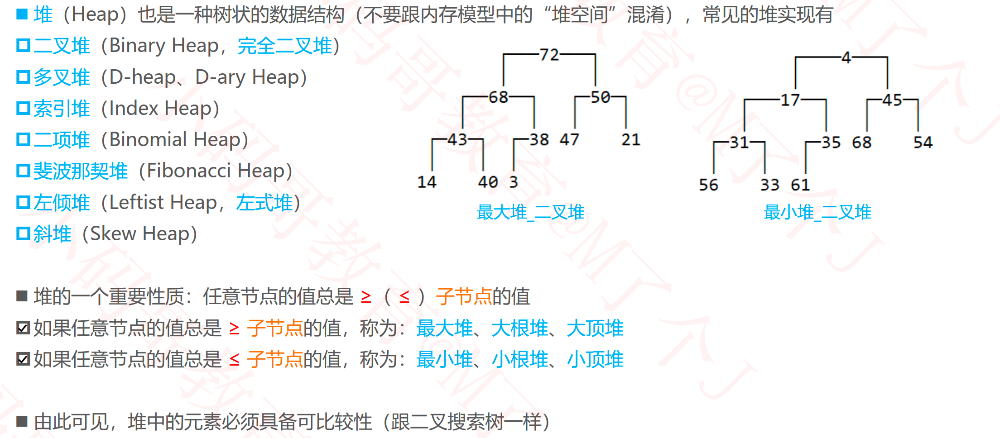

### 堆的基本接口设计

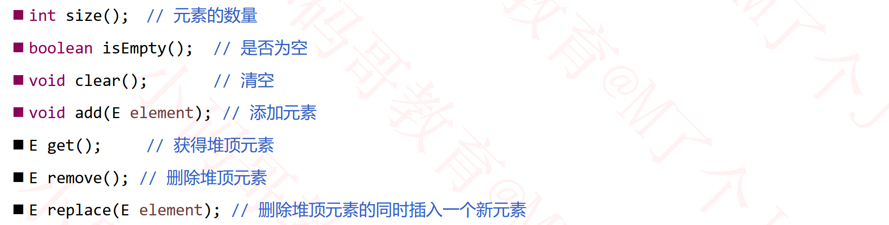

## 二叉堆（Binary Heap）

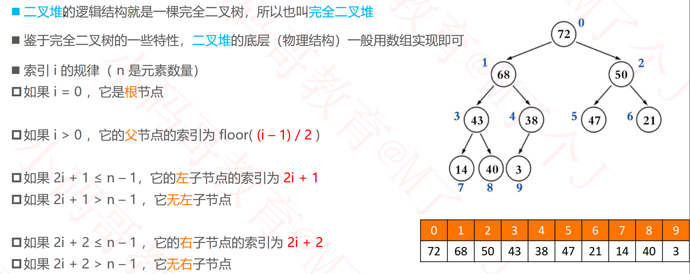

### 最大堆

#### 获取最大值

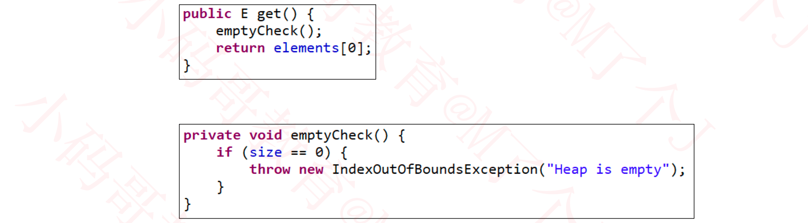

#### 添加

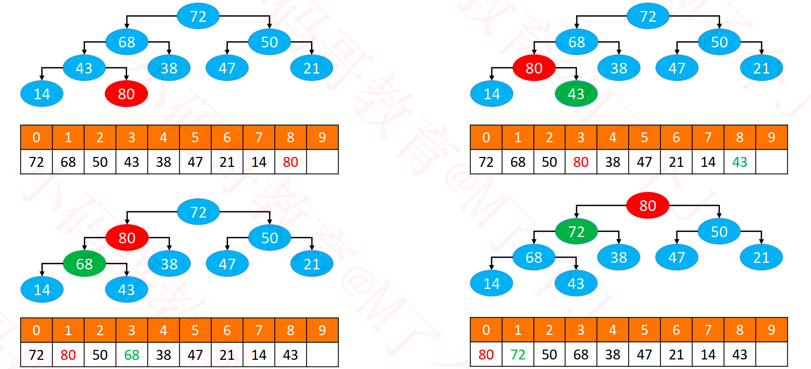

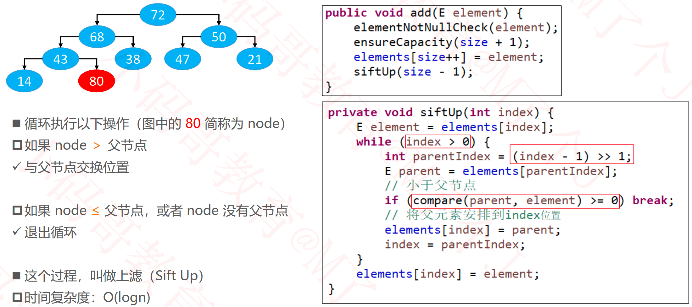

##### 添加交换位置的优化

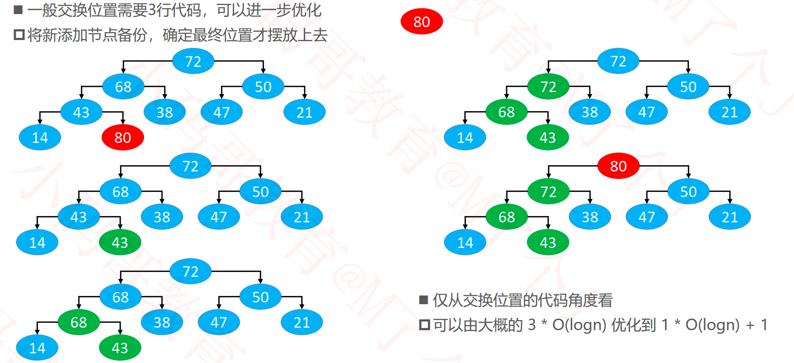

#### 删除

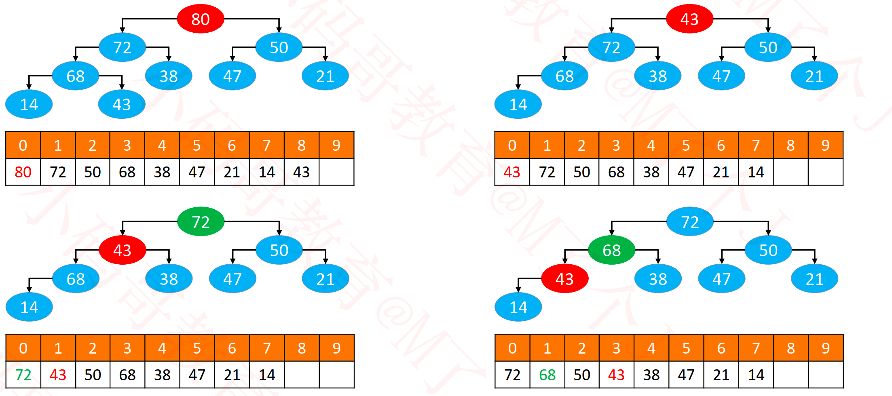

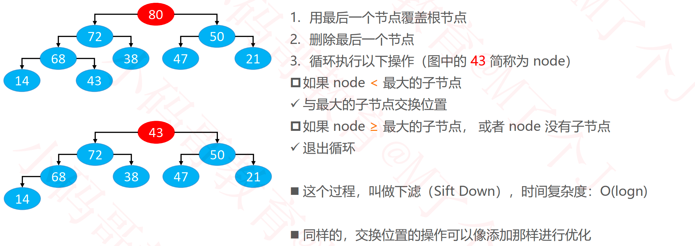

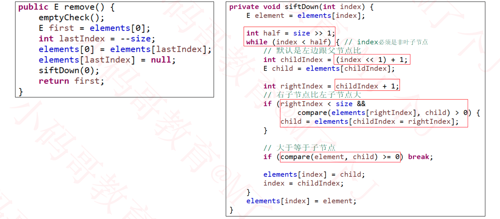

#### 替换

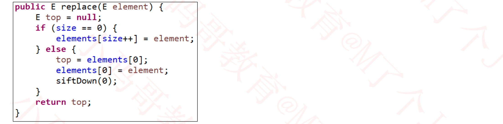

#### 批量建堆（Heapify）

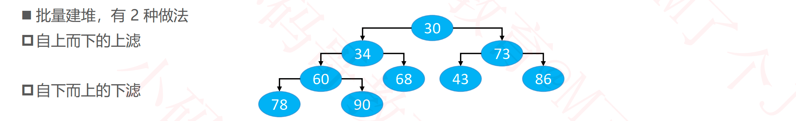

##### 自上而下的上滤

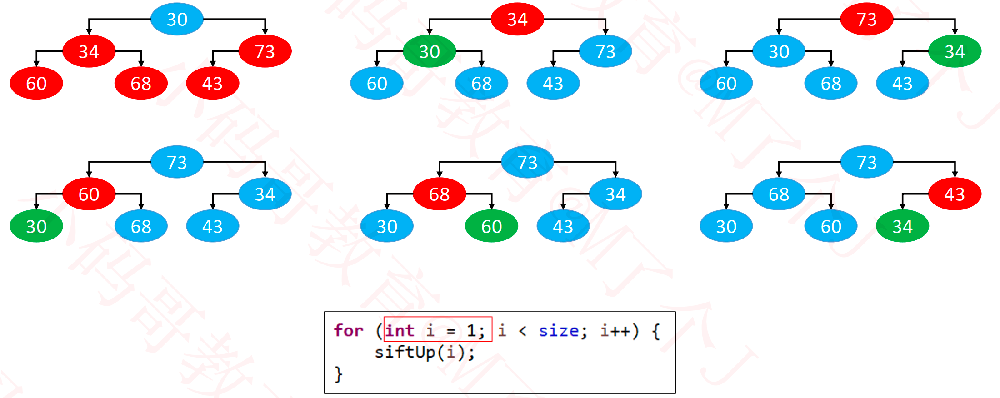

##### 自下而上的下滤

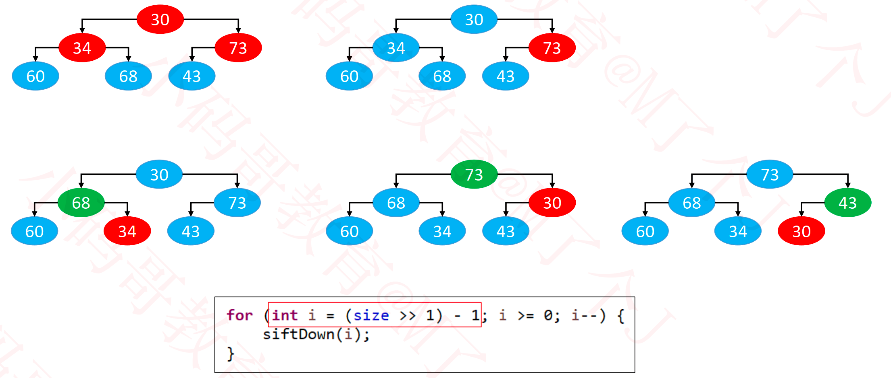

##### 效率对比

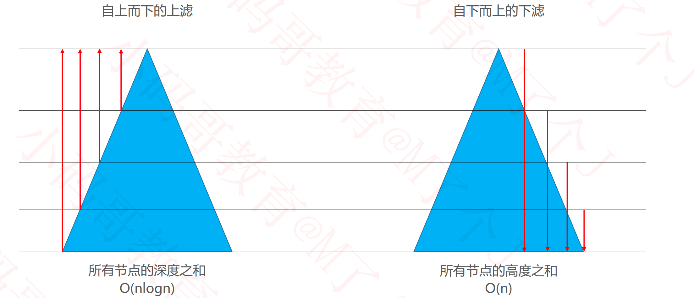

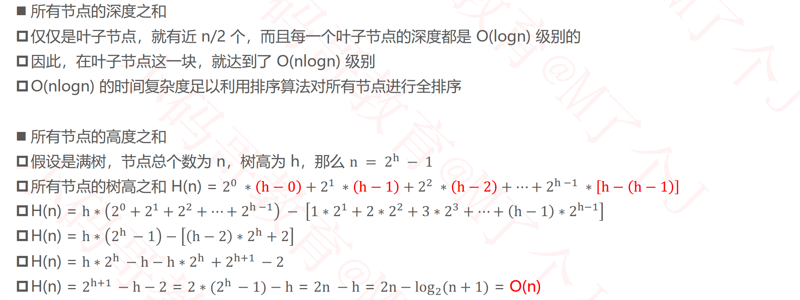

##### 公式推导

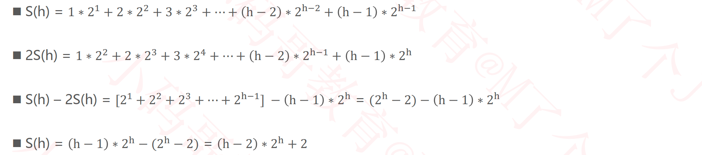

##### 疑惑

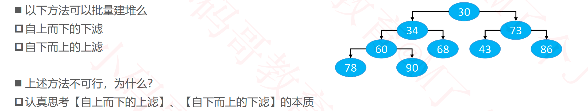

##### 批量建堆

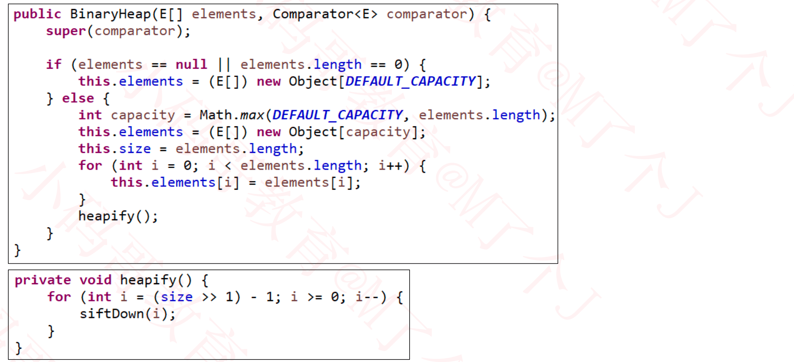

### 如何构建一个小顶堆？

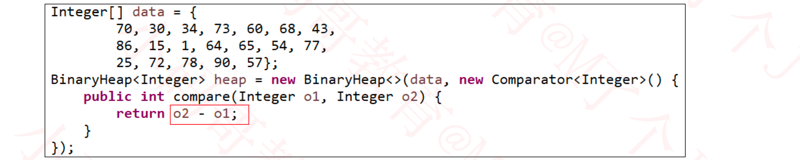

### Top K问题

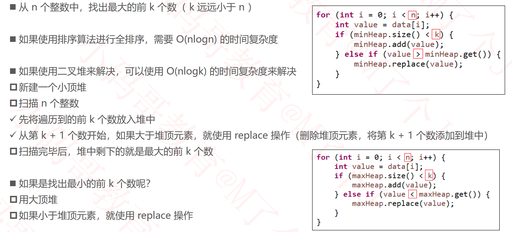

### 作业

- 了解和实现堆排序
- 使用堆排序将一个无序数组转换成一个升序数组
  - 空间复杂度能否下降至0(1)?