## 链表（Linked List）

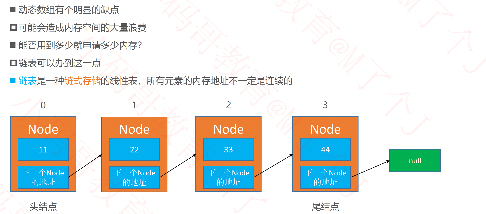

### 链表的设计

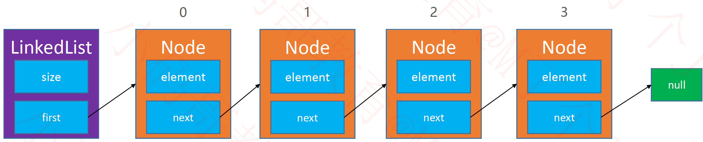

### 接口设计

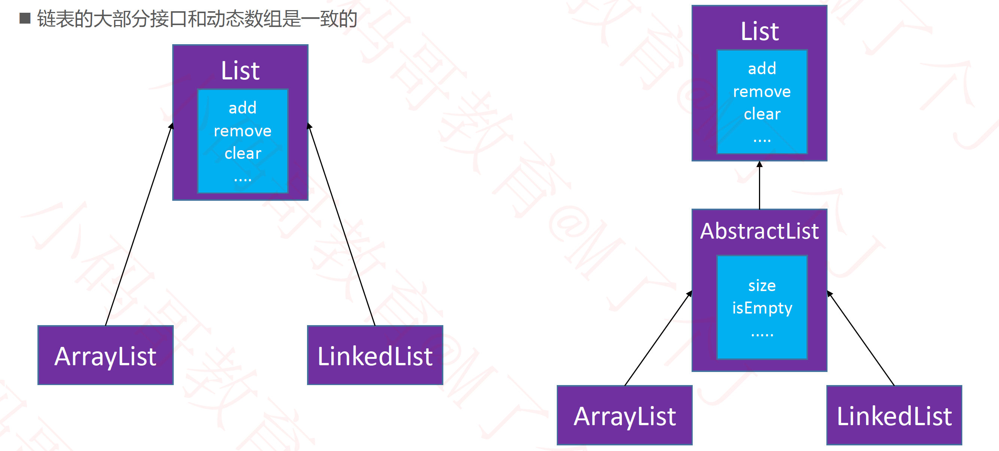

### 清空元素 - clear()

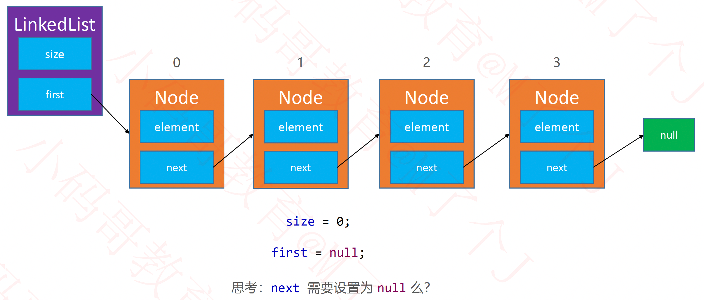

### 添加元素

#### 添加元素 - add(int index, E element)

#### node方法用于获取index位置的节点

#### 注意0位置

### 删除元素

#### 删除元素 - remove(int index)

#### 注意0位置

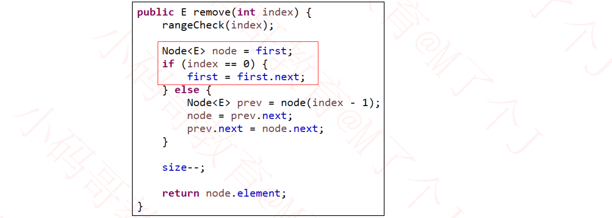

### 练习

#### 删除链表中的节点

- https://leetcode-cn.com/problems/delete-node-in-a-linked-list/

#### 翻转一个链表

- https://leetcode-cn.com/problems/reverse-linked-list/

#### 判断一个链表是否有环

- https://leetcode-cn.com/problems/linked-list-cycle/

### 虚拟头结点

#### node方法

#### 添加、删除

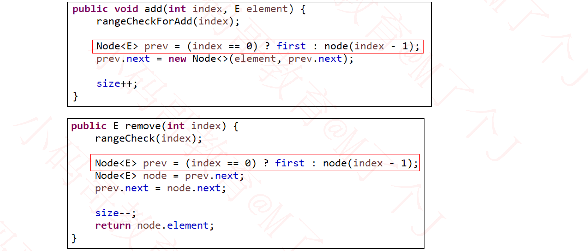

### 复杂度分析

- 最好情况复杂度
- 最坏情况复杂度
- 平均情况复杂度

#### 数组的随机访问

#### 动态数组、链表复杂度分析

#### 动态数组add(E element)复杂度分析

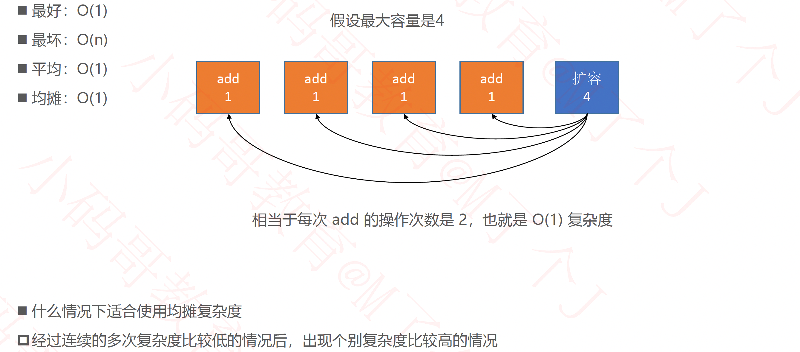

#### 动态数组的缩容

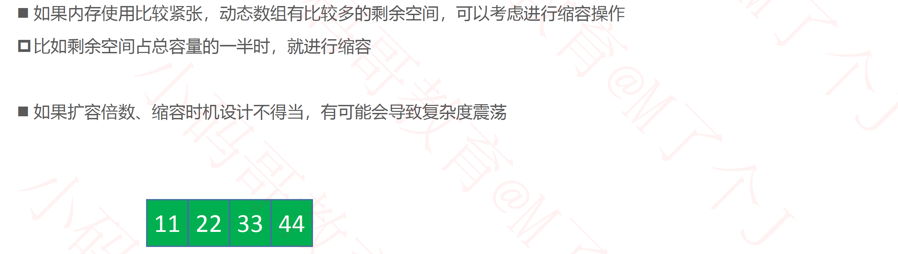

### 双向链表

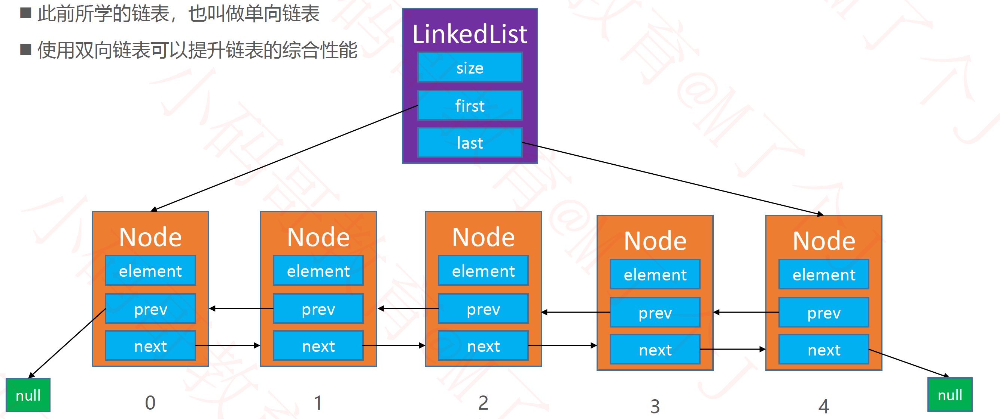

#### 只有一个元素

#### node方法

#### add(int index, E element)

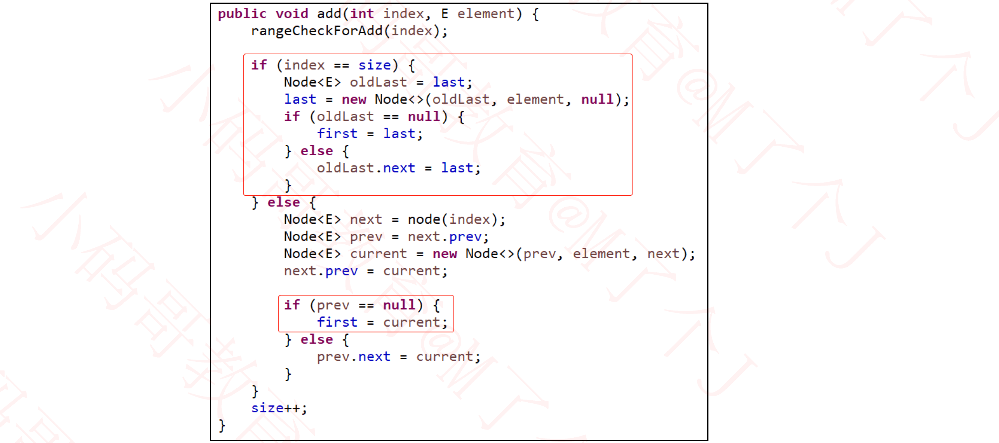

#### remove(int index)

#### 双向链表 vs 单向链表

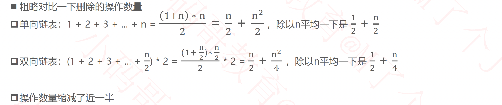

#### 双向链表 vs 动态数组

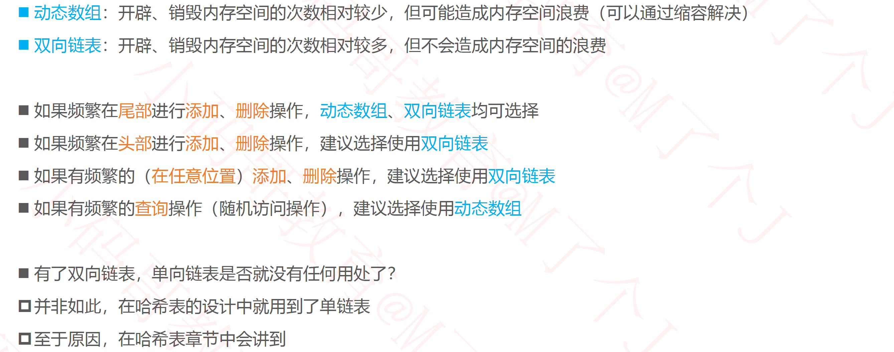

#### LinkedList源码分析

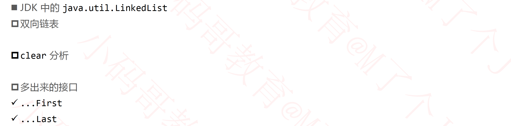

### 单向循环链表

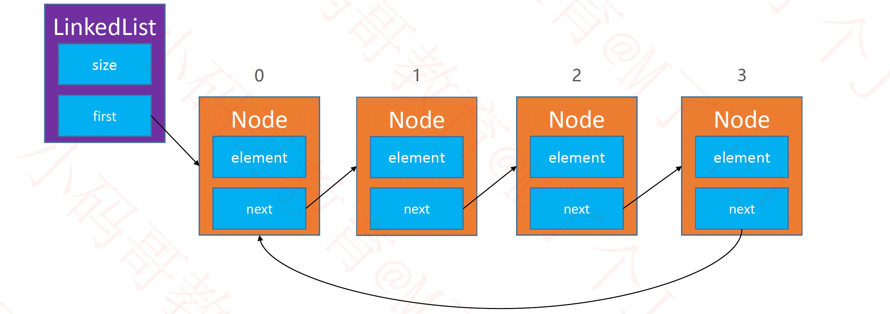

#### 只有1个节点

#### add(int index, E element)

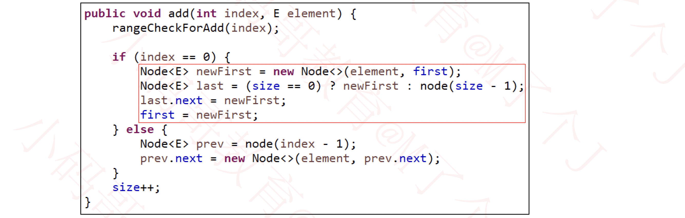

#### remove(int index)

### 双向循环链表

#### 只有1个节点

#### add(int index, E element)

#### remove(int index)

### 练习

#### 约瑟夫问题(Josephus Problem)

### 静态链表

### 作业

#### 移除链表中的元素

- https://leetcode-cn.com/problems/remove-linked-list-elements/

#### 删除排序链表中的重复元素

- https://leetcode-cn.com/problems/remove-duplicates-from-sorted-list/

#### 链表中间节点

- https://leetcode-cn.com/problems/middle-of-the-linked-list/solution/

### 思考

ArrayList是否能进一步优化？

- 循环数组