## 映射（Map）

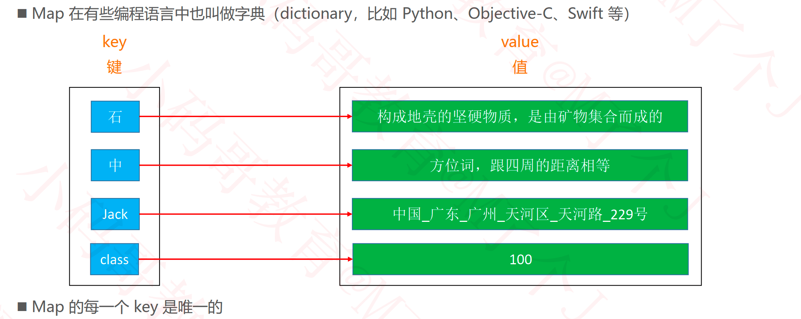

### 接口设计

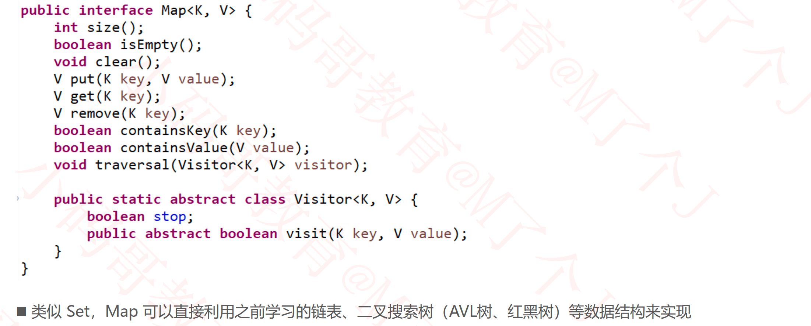

### Map 与 Set

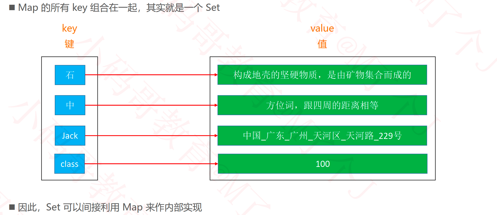

## 哈希表

### TreeMap分析

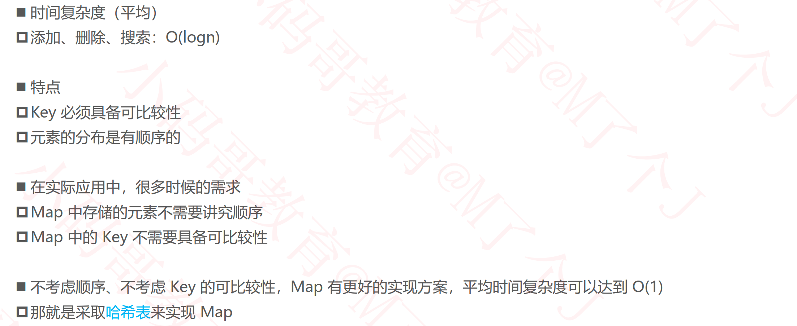

### 需求

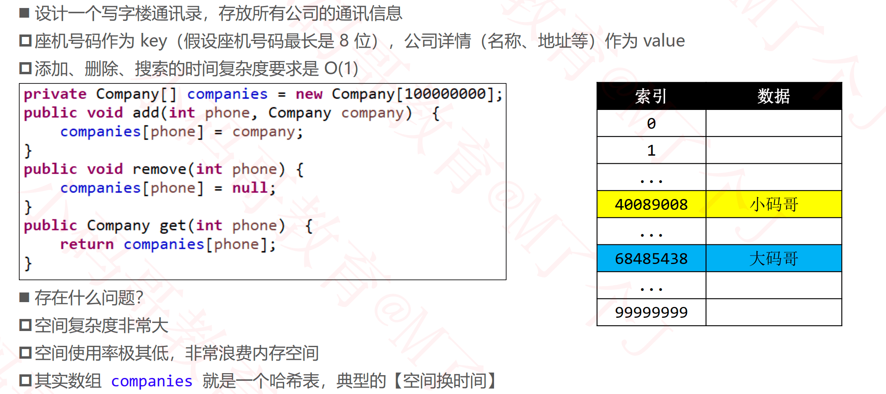

### 哈希表（Hash Table）

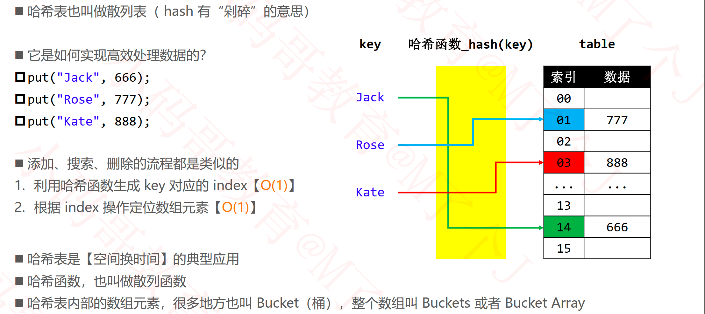

### 哈希冲突（Hash Collision）

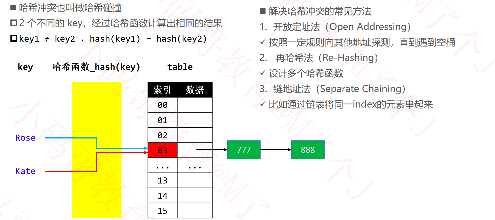

### JDK1.8的哈希冲突解决方案

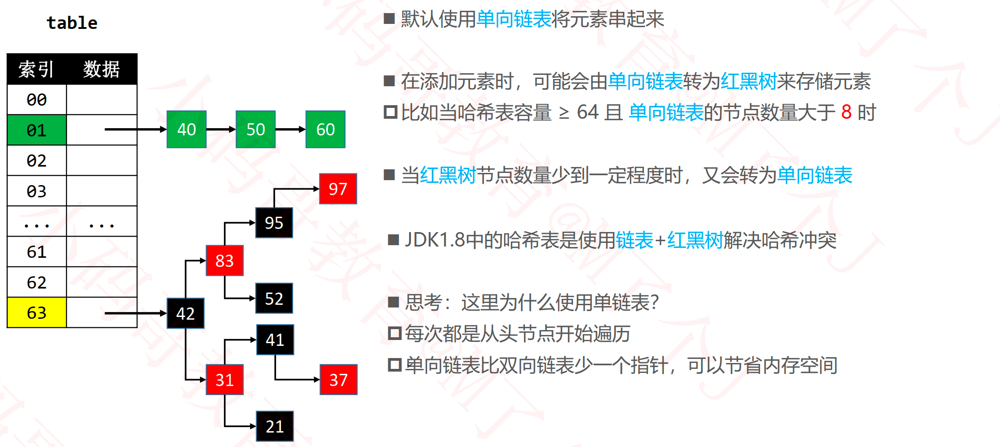

### 哈希函数

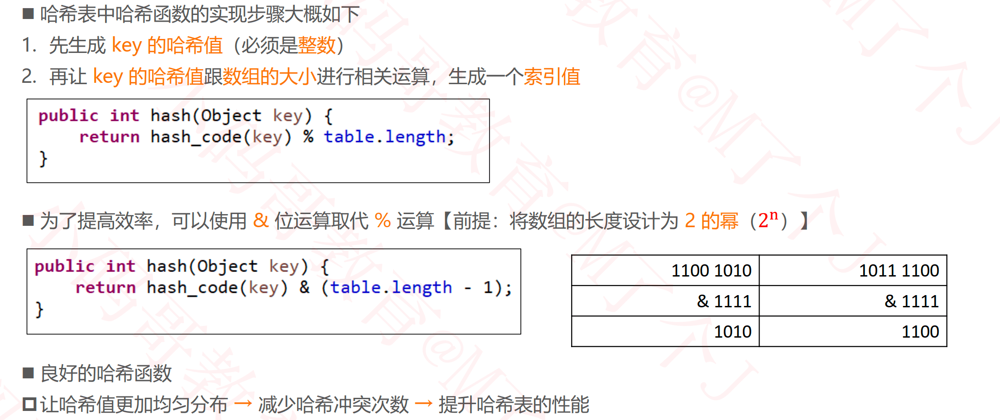

### 如何生成key的哈希值

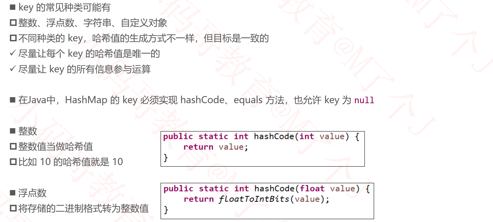

### Long和Double的哈希值

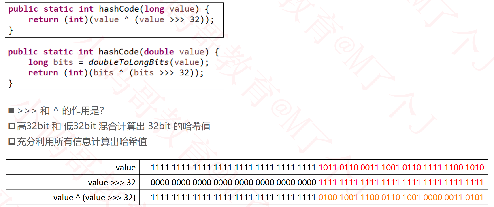

### 字符串的哈希值

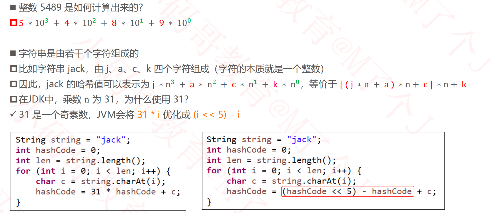

### 关于31的探讨

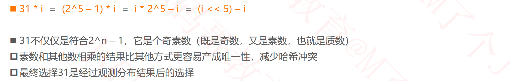

### 自定义对象的哈希值

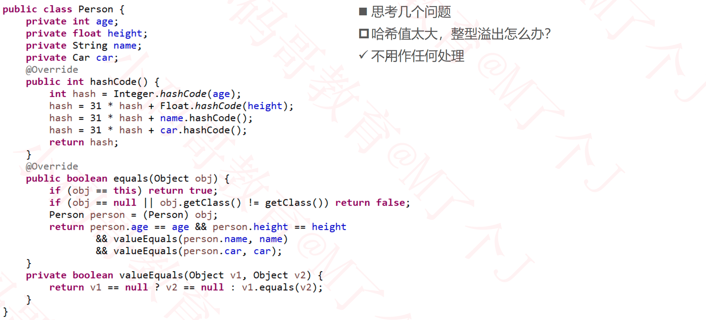

### 自定义对象作为key

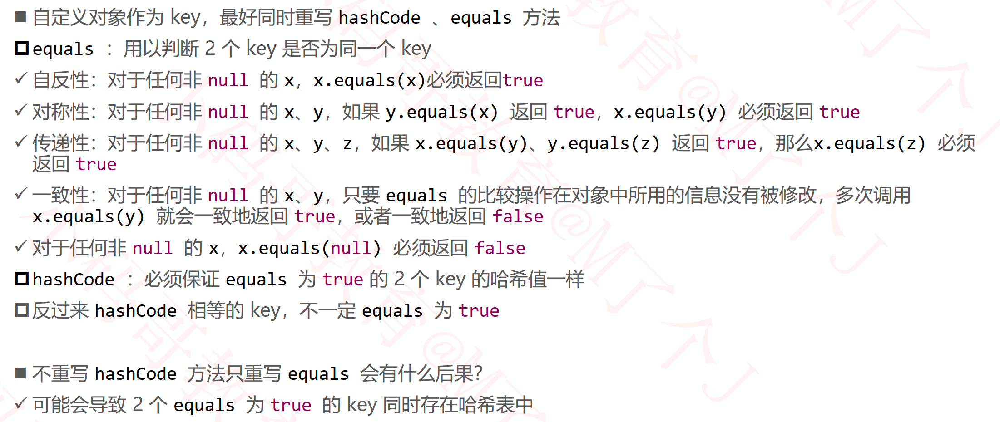

### 哈希值的进一步处理：扰动计算

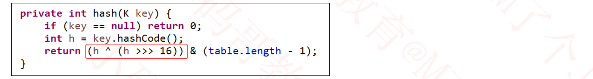

### 装填因子

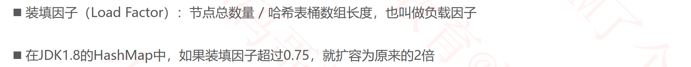

### TreeMap vs HashMap

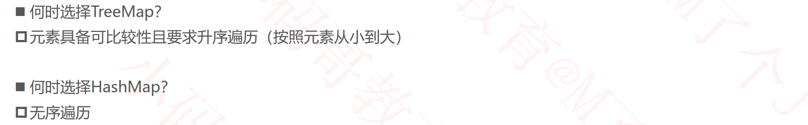

### LinkedHashMap

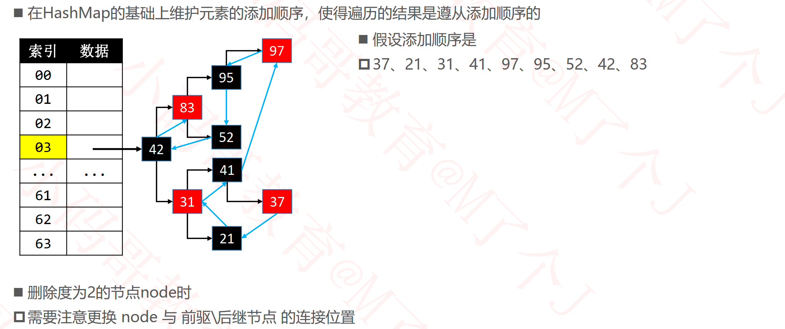

#### 删除注意点

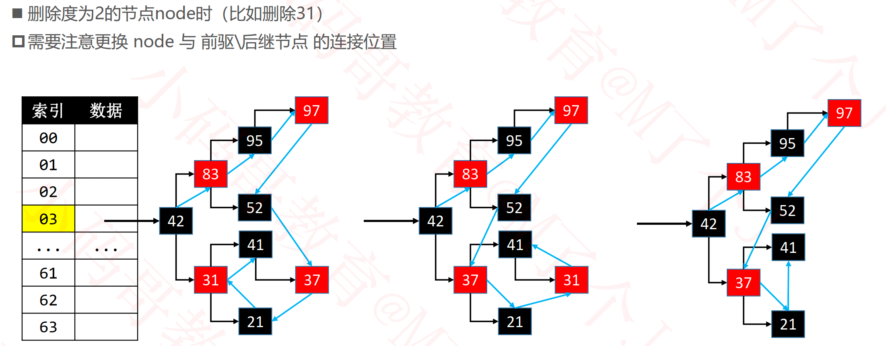

- 31与其后继37进行交换。

#### 更换节点的连接位置

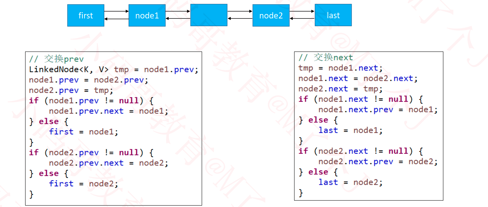

### 关于使用%来计算索引

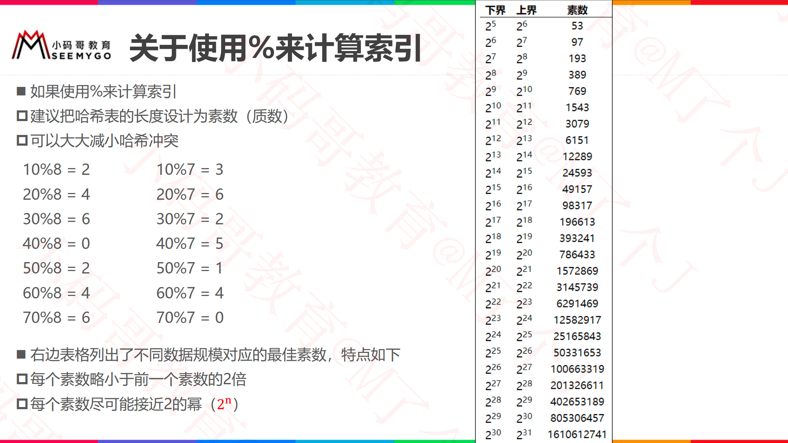

