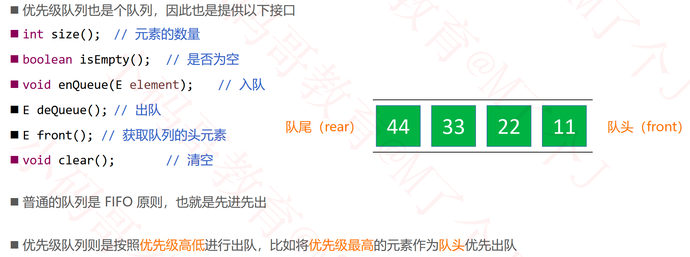
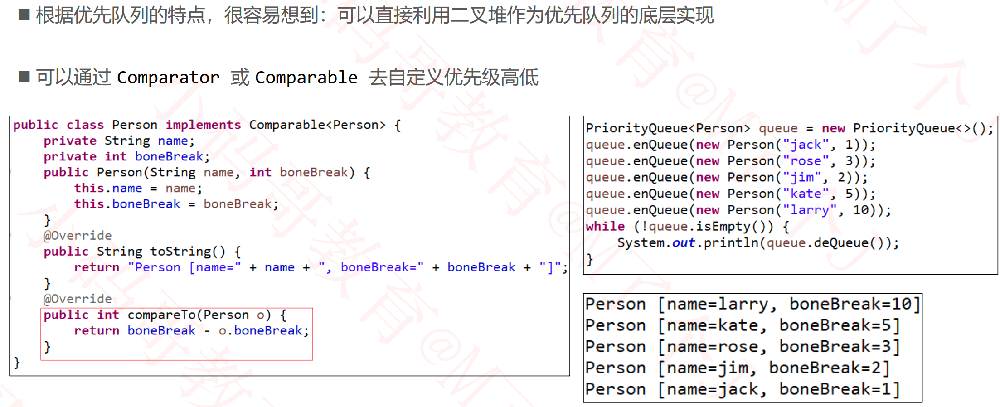

## 优先级队列（Priority Queue）

### 优先级队列的应用场景举例

### 优先队列的底层实现

### 作业

#### 数组中的第K个最大元素

- https://leetcode-cn.com/problems/kth-largest-element-in-an-array/

#### 根据字符出现频率排序

- https://leetcode-cn.com/problems/sort-characters-by-frequency/

#### 数据流中的第K大元素

- https://leetcode-cn.com/problems/kth-largest-element-in-a-stream/

#### 有序矩阵中第K小的元素

- https://leetcode-cn.com/problems/kth-smallest-element-in-a-sorted-matrix/

#### 前K个高频元素 

- https://leetcode-cn.com/problems/top-k-frequent-elements/

#### 前K个高频单词

- https://leetcode-cn.com/problems/top-k-frequent-words/

#### 查找和最小的K对数字

- https://leetcode-cn.com/problems/find-k-pairs-with-smallest-sums/

#### 合并K个排序链表

- https://leetcode-cn.com/problems/merge-k-sorted-lists/

