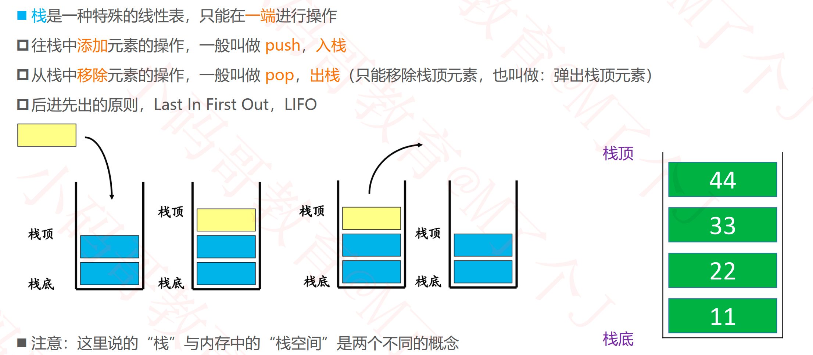
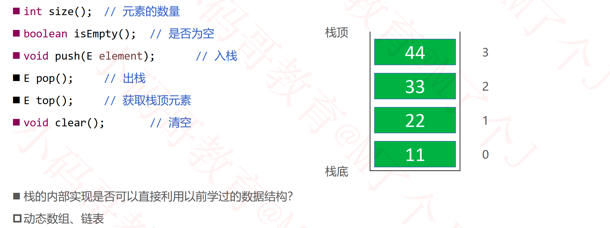
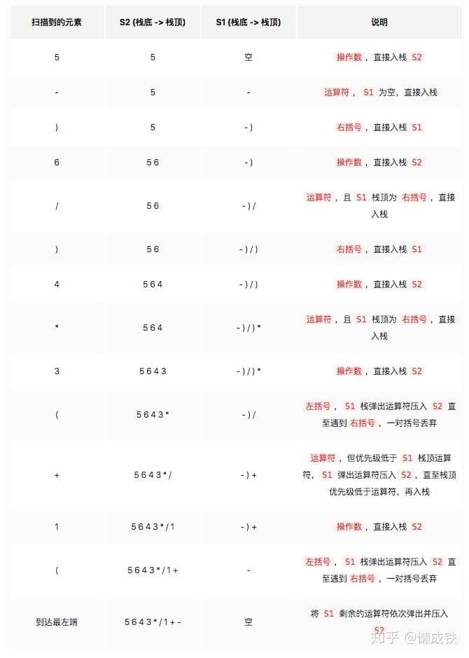
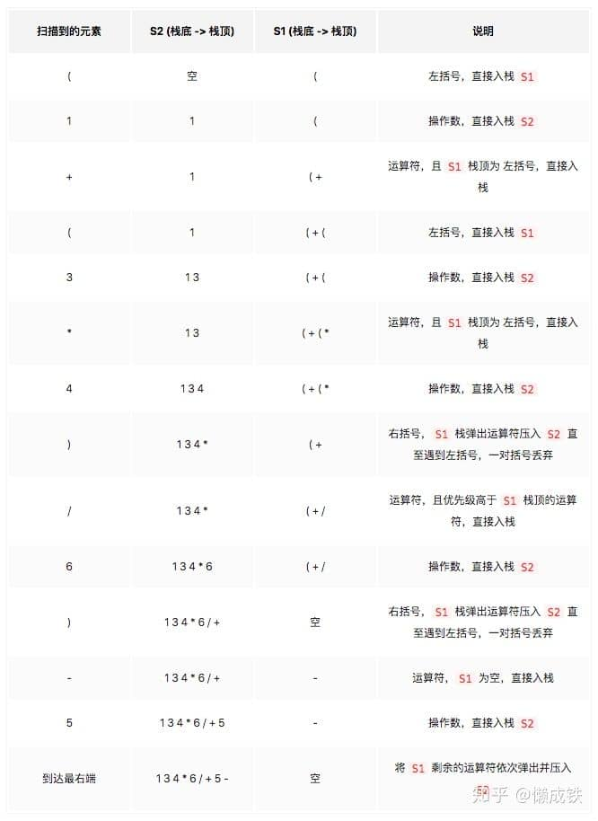

## 栈（Stack）

### 栈的接口设计

### 栈的应用 – 浏览器的前进和后退

### 中缀表达式转前缀表达式

**思路**

1. 初始化两个栈：运算符栈 `S1`; 操作数栈 `S2`

2. 从右至左扫描中缀表达式

3. 遇到`操作数`时，将其压入 `S2`

4. 遇到`运算符`时，比较其与 `S1` 栈顶运算符的优先级
		1. 如果 **`S1` 为空**，或**栈顶运算符为右括号 `")"`**，或**其优先级比栈顶运算符的优先级较高或相等**，则直接将`此运算符`入栈
		2. 否则，将 `S1` 栈顶的运算符弹出并压入到 `S2` 中，再次进行与 `S1` 栈顶运算符的优先级比较
5. 遇到`括号`时
		1. 如果是`右括号 ")"`，则直接压入 `S1`
		2. 如果是`左括号 "("`，则依次弹出 `S1` 栈顶的运算符，并压入 `S2`，直到遇到`右括号 ")"`为止，此时将这`一对括号`丢弃

6. 重复步骤 2 至 5，直到表达式的最左边

7. 将 `S1` 剩余的运算符依次弹出并压入 `S2`

8. 依次弹出 `S2` 中的元素并输出，结果即为中缀表达式对应的前缀表达式

**栗子：(1 + (3 * 4) / 6 ) - 5** 

依次弹出 `S2` 中的元素并输出结果： **-+1/\*3465**

### 中缀表达式转后缀表达式

**思路**

1. 初始化两个栈：运算符栈 `S1`; 操作数栈 `S2`

2. 从左至右扫描中缀表达式

3. 遇到`操作数`时，将其压入 `S2`

4. 遇到`运算符`时，比较其与 `S1` 栈顶运算符的优先级
   1. 如果 **`S1` 为空**，或**栈顶运算符为`左括号 "("`**，或**其优先级比栈顶运算符的优先级较高**，则直接将`此运算符`入栈
   2. 否则，将 `S1` 栈顶的运算符弹出并压入到 `S2` 中，再次进行与 `S1` 栈顶运算符的优先级比较

5. 遇到括号时
   1. 如果是`左括号 "("`，则直接压入 `S1`
   2. 如果是`右括号 ")"`，则依次弹出 `S1` 栈顶的运算符，并压入 `S2`，直到遇到`左括号 "("`为止，此时将这`一对括号`丢弃

6. 重复步骤 2 至 5，直到表达式的最右边

7. 将 `S1` 剩余的运算符依次弹出并压入 `S2`

8. 拼接 `S2` 中的元素并输出，结果即为中缀表达式对应的后缀表达式

**栗子： (1 + (3 * 4) / 6 ) - 5**

拼接 `S2` 中的元素并输出结果：**134\*6/+5-**

### 练习

#### 有效的括号

- https://leetcode.com/problems/valid-parentheses/

#### 括号的分数