## 需求分析

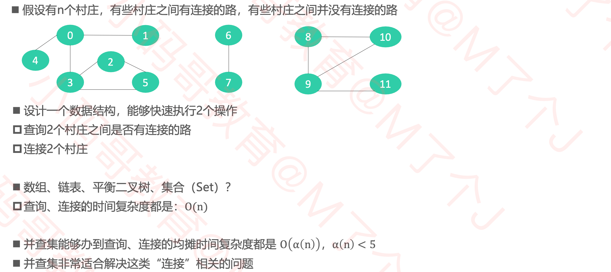

## 并查集（Union Find）

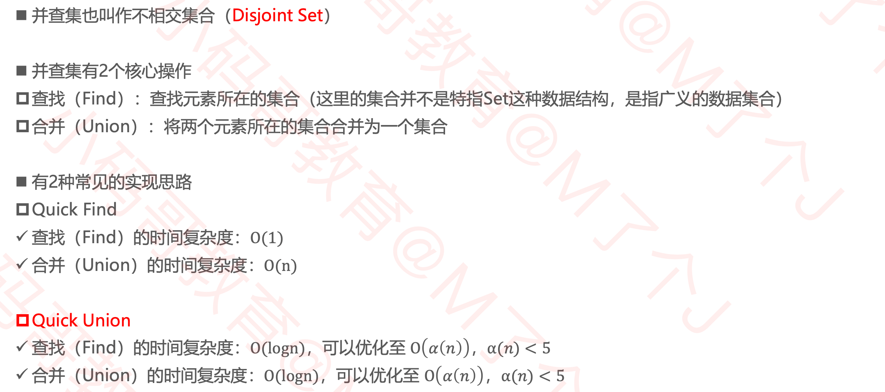

### 如何存储数据？

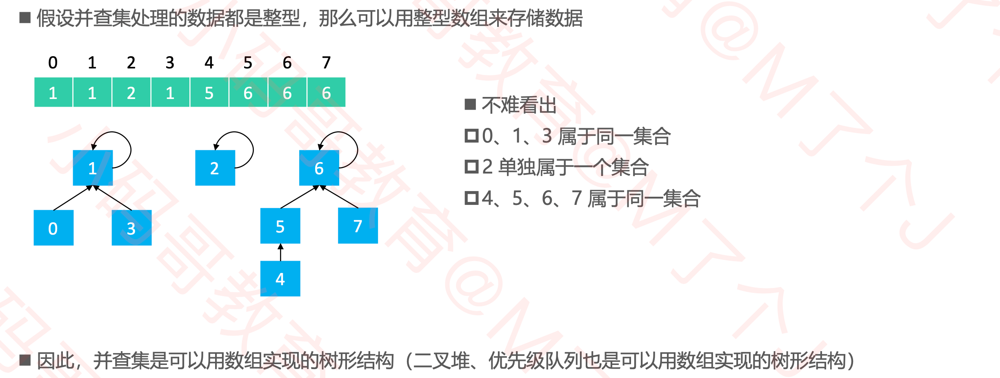

### 接口定义

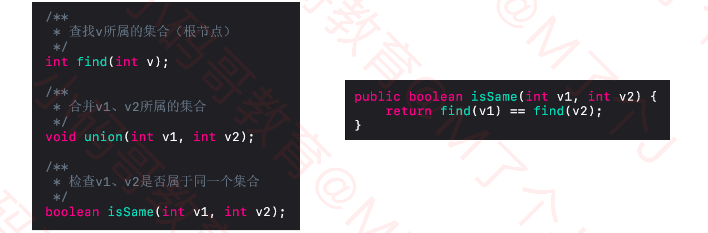

### 初始化

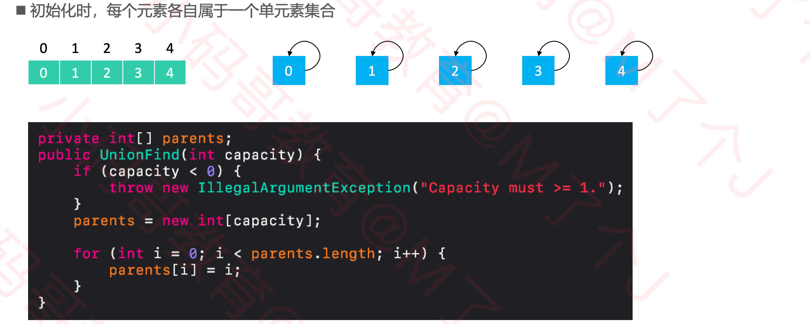

### Quick Find

#### Union

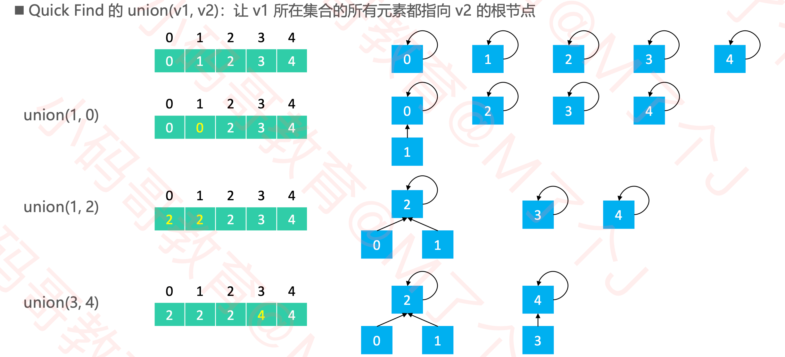

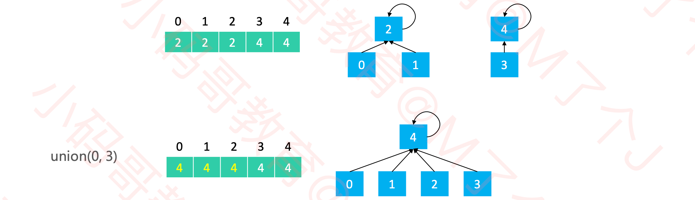

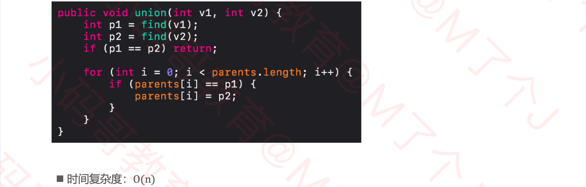

#### Find

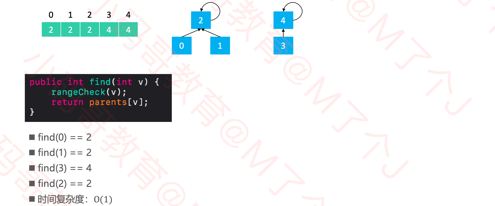

### Quick Union

#### Union

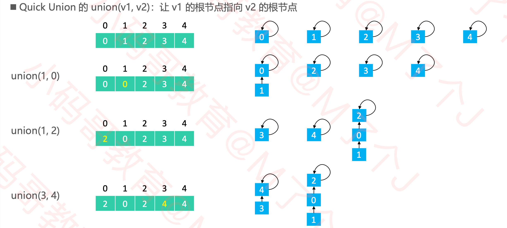

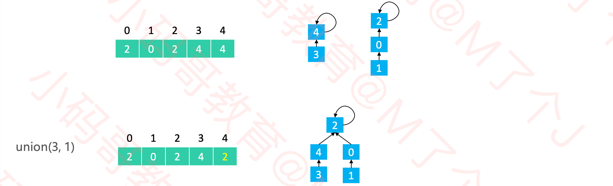

#### Find

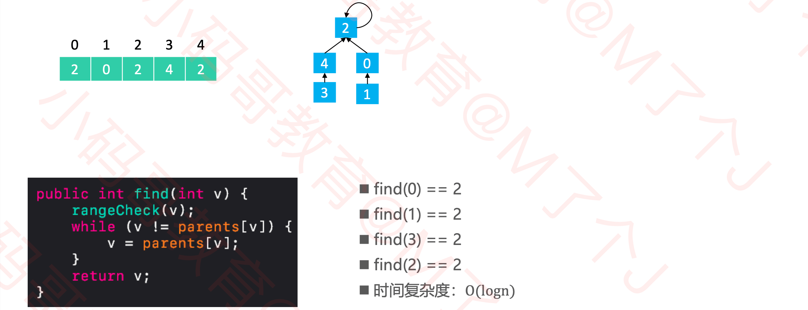

#### 优化

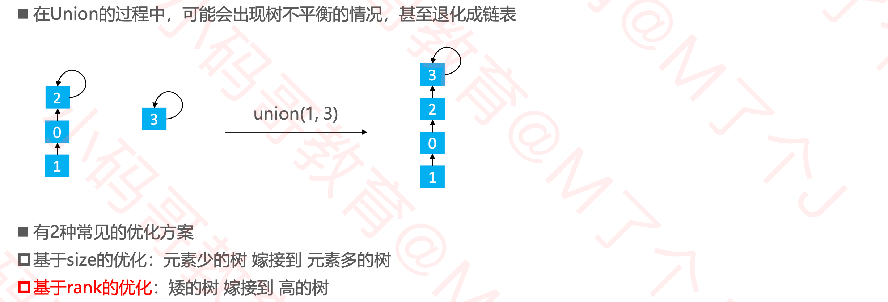

##### 基于size的优化

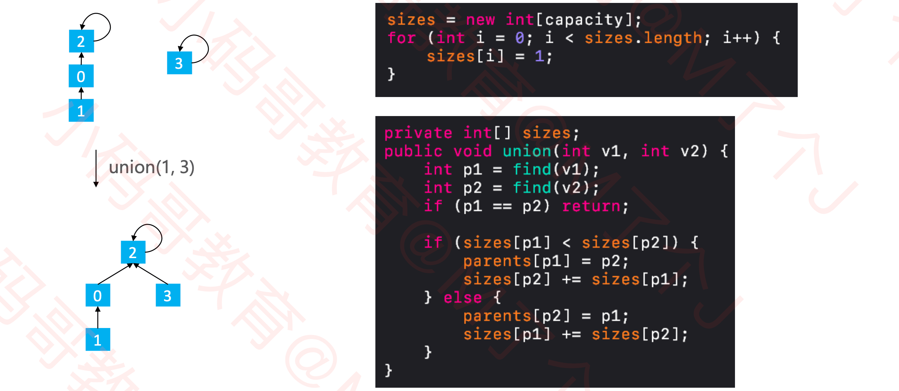

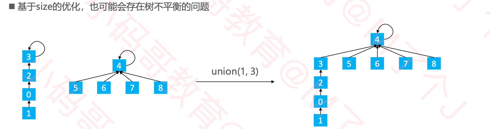

##### 基于rank的优化

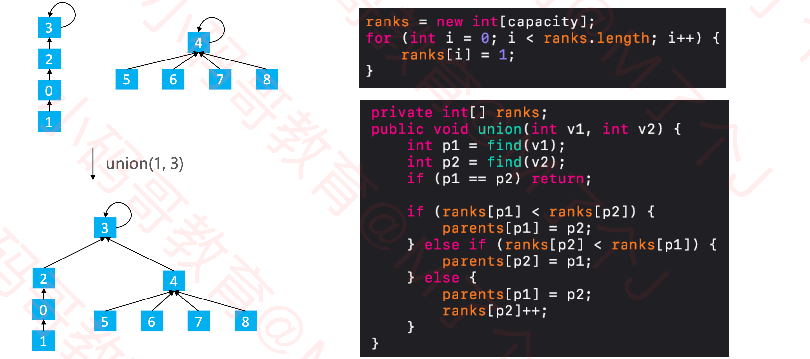

##### 路径压缩（Path Compression）

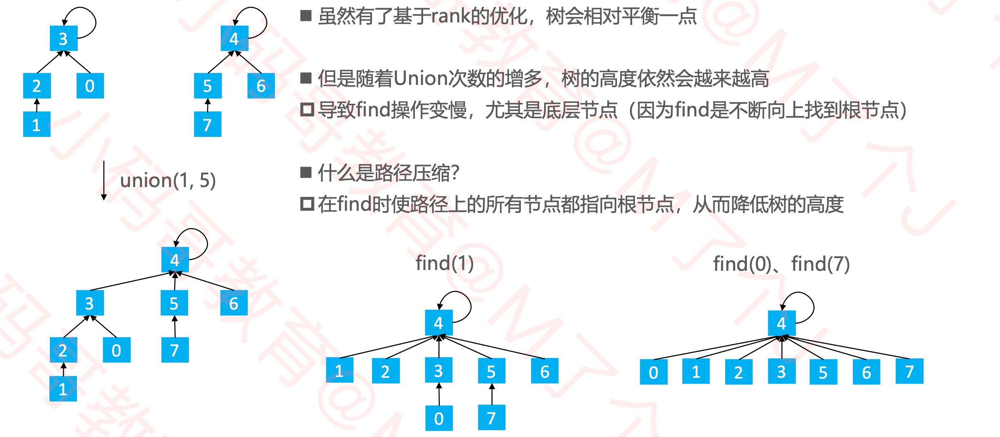

##### 路径分裂（Раth Ѕрlіtіng）

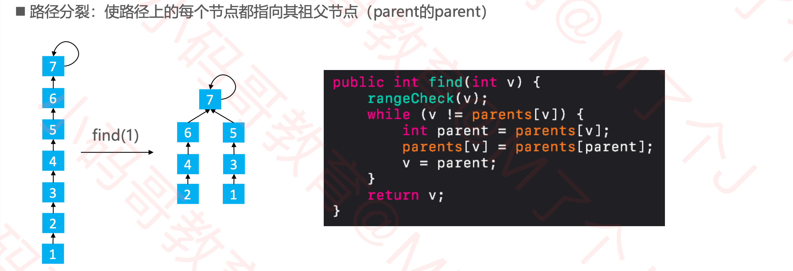

##### 路径减半（Path Halving）

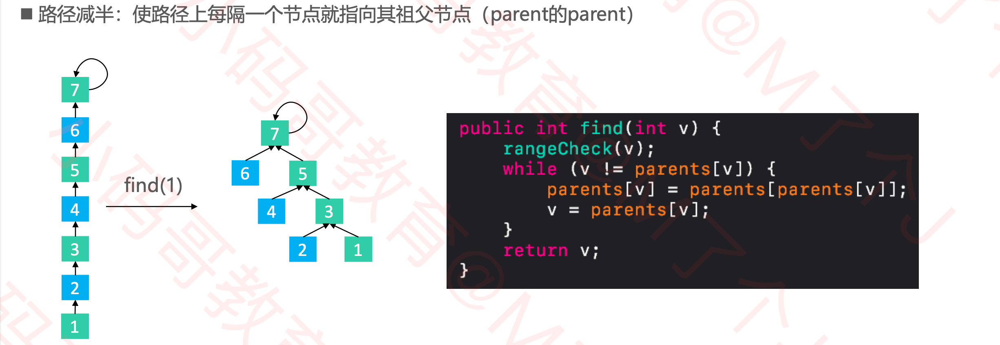

### 总结

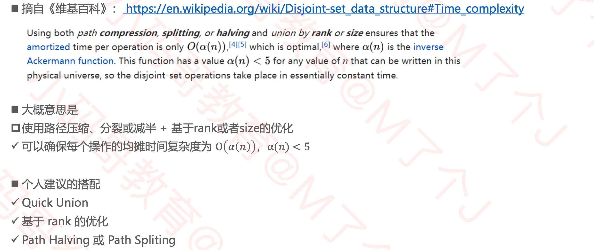

### 自定义类型

